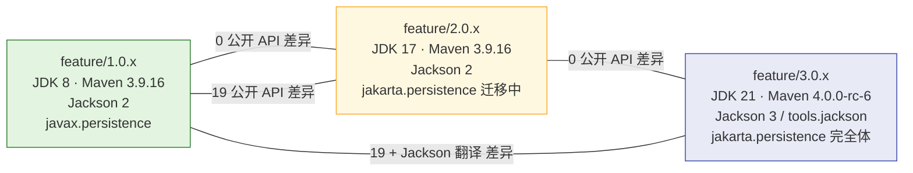

# 8、ddd4j-1.0.x-Architecture.zh_CN

> **文档说明**：ddd4j **1.0.x 版本级架构**。聚焦于：在三轨治理中 1.0.x 的角色、JDK 8 / Maven 3 字节码约束、Stage E 整合策略、5 事件存储与 11 broker 的实际落地、与 2.0.x / 3.0.x 的允许差异与禁止差异。
>
> **版本**：V1.0.0
> **最后更新**：2026-09-18
> **对齐代码 HEAD**：`41f690b7`
> **JdkTarget**：8
> **Maven**：3.9.16

---

## 1. 1.0.x 在三轨中的位置



**1.0.x 的真实角色**：

1. **生产在用线**——仍在企业生产环境跑（JDK 8 兼容、Sentinel 探针、Spring 4/5 兼容）。
2. **三线治理中枢**——承担 Stage E 整合、三线严格门禁、license 门禁、MQ durability 等共享修复的源。
3. **可回退锚点**——2.0.x / 3.0.x 任何破坏性变更必须先在 1.0.x 找到兼容实现或被显式拒绝。

## 2. 字节码与依赖约束

### 2.1 JDK 8 字节码（class major = 52）

所有 `1.0.x` 模块的 `.class` 文件主版本号固定为 **52（JDK 8）**。这意味着：

- 不能用 `var` / `record` / 模式匹配 / 文本块 / `instanceof PatternVar` / 私有接口方法。
- 不能依赖 `java.net.http.HttpClient`（JDK 11+）。
- Spring Framework ≤ 5.3.x；Spring Boot ≤ 2.7.x。
- Hibernate Validator ≤ 6.2.x（不用 jakarta 命名空间）。
- Jackson ≤ 2.16.x（不用 Jackson 3 `tools.jackson`）。
- Quarkus 不能用 3.x（最低字节码 major = 61）；Helidon 3.2.18 不能用（JDK 11+ required）。

### 2.2 不在 1.0.x 的模块

按 2026-09-09 严格审计结论，1.0.x **缺失** 以下 4 个模块（Helidon 适配受字节码约束）：

- `ddd4j-data-cqrs-helidon`
- `ddd4j-data-projection-helidon`
- `ddd4j-runtime-helidon`
- `ddd4j-web-helidon`

这 4 个模块在 2.0.x / 3.0.x 中存在。

### 2.3 已完整包含的 1.0.x 模块

按当前 `41f690b7` 工作树确认，1.0.x 已包含与 2.0/3.0 字面级同构的：

- 5 个 EventStore 实现（`InMemory` / `Esdb` / `JPA` / `JDBI` / `R2DBC` / `Panache` —— 实际是 6 个，2026-09-03 Stage E 后从 3.0.x 移植 PanacheEventStore）。
- 12 个 broker 适配器（Kakfa / RabbitMQ / RocketMQ / Redis Stream / NATS / Pulsar / ActiveMQ / MQTT / Mica MQTT / ONS / SQS / TDMQ / Disruptor）。
- 8 个 Web 适配（WebMVC / WebFlux / Javalin / Quarkus / Vert.x / Micronaut / Helidon / Dropwizard）。
- 8 个 runtime binder（Spring / Quarkus / Guice / Micronaut / Vert.x / Helidon / Dropwizard / Testkit）。
- 9 条 ArchUnit 边界规则。

## 3. 与 2.0.x / 3.0.x 的允许 / 禁止差异

### 3.1 允许差异（属"必要兼容差异"）

| 类别 | 1.0.x | 2.0.x | 3.0.x | 原因 |
|:---|:---|:---|:---|:---|
| JDK 字节码 | major 52 | major 61 | major 61 | 1.0.x 兼容 JDK 8 |
| 语法糖 | `Collections.unmodifiableList(new ArrayList<>(...))` | `List.copyOf(...)` | `List.copyOf(...)` | 1.0.x 不能用 JDK14+ 语法 |
| Jackson | 2.x | 2.x | 3.x（`tools.jackson`） | 3.0.x 试用 Jackson 3 |
| JPA | `javax.persistence` | `jakarta.persistence`（迁移中） | `jakarta.persistence`（完全体） | Jakarta EE 迁移 |
| Maven | 3.9.16 | 3.9.16 | 4.0.0-rc-6 | 3.0.x 试用 Maven 4 |
| `record` | ❌ | ✅ | ✅ | 1.0.x 字节码约束 |
| Helidon | ❌ | ✅ | ✅ | 1.0.x 字节码约束 |
| `instanceof` 模式变量 | ❌ | ✅ | ✅ | 1.0.x 字节码约束 |
| Dropwizard 包路径 | `io.dropwizard.*` | `io.dropwizard.core.*` | `io.dropwizard.core.*` | Dropwizard 5 重构 |
| Spring 扩展路径 | `org.springframework.biz.*` | `org.springframework.extension.*` | `org.springframework.extension.*` | Spring 6 重构 |
| Micronaut filter 入口 | `doFilter(HttpRequest, FilterChain)` | `filter(HttpRequest, FilterContinuation, MutablePropagatedContext)` | `filter(HttpRequest, FilterContinuation, MutablePropagatedContext)` | Micronaut 4.x 改 API |
| Javalin `configure` 参数 | `configure(Javalin)` | `configure(JavalinConfig)` | `configure(JavalinConfig)` | Javalin 7.x 改 API |
| WebMVC 远程地址 | raw `request.getRemoteAddr()` | `IpKit.getRemoteAddr()` | `IpKit.getRemoteAddr()` | 1.0.x 实现粗糙 |
| Micronaut remote host fallback | `getHostString()` | `unknown` | `unknown` | 实现差异，待归类 |

### 3.2 禁止差异（属"必须修复"）

- ❌ 公共方法签名变化（`EventStore.append` / `CommandBus.execute` / `ProjectionRunner.runOnce` 等）。
- ❌ 公共异常类变化（`AggregateVersionConflictException` 等）。
- ❌ EventStore 同输入行为差异（16 个断言，详见 `docs/superpowers/reports/2026-09-09-three-line-source-parity-audit.md`）。
- ❌ 值对象 `equals` / `hashCode` / `toString` 输出差异。
- ❌ 模块清单增删（必须三线同步）。

## 4. Stage E 整合动作（2026-09）

Stage E 是 1.0.x 在 2026-09 期间吸收 2.0/3.0 能力的整合动作：

| Commit | 行为 |
|:---|:---|
| `0c295e3e refactor(2.0.x): converge parity and dependency governance` | 三线依赖治理收敛 |
| `acb59b0f feat(data): port EventStoreRetry + unify jdbi/panache impls with 3.0.x` | 把 3.0.x 的 JDBI/Panache EventStoreRetry 移植到 1.0.x |
| `41f690b7 fix(mq): bound publish ack timeouts and replace ThreadLocal channel with bounded pool` | 三线同步推送 MQ 健壮性 |
| `3344af38 fix(mq): prevent Kafka batch duplicate consumption and RabbitMQ listener leak` | 三线同步推送 Kafka/RabbitMQ 修复 |

**Stage E 的关键原则**：

1. **1.0.x 是同步源**——所有跨线共享修复以 1.0.x commit 为准，2.0/3.0 cherry-pick。
2. **降级优先保留**——任何 1.0.x 新增的方法/类，必须在语法上兼容 JDK 8。
3. **bytecode major 52 不变**——ArchUnit 守护 + `mvn -X verify` 在 1.0.x 上跑 `javap -v` 抽检。

## 5. 1.0.x 模块矩阵（与三线总览一致）

| 模块 | 1.0.x 状态 | 备注 |
|:---|:---|:---|
| `ddd4j-core` | ✅ 字面级一致 | JDK 8 兼容写法 |
| `ddd4j-data-mybatis` | ✅ | 业务模型不绑 MyBatis-Plus |
| `ddd4j-data-mybatisplus` | ✅ | `MybatisAggregateRepository` |
| `ddd4j-data-jpa` | ✅ | `javax.persistence` |
| `ddd4j-data-event-store-jpa` / `-jdbi` / `-r2dbc` / `-esdb` | ✅ | 4 个实现 |
| `ddd4j-data-event-store-panache` | ✅（Stage E 移植） | `jakarta.persistence` EntityManager 在源码层可用；编译需 Quarkus BOM |
| `ddd4j-data-cqrs-{spring,guice,quarkus,vertx,javalin,micronaut,dropwizard}` | ✅ | 7 个 |
| `ddd4j-data-cqrs-helidon` | ❌ | 字节码约束 |
| `ddd4j-runtime-{spring,guice,quarkus,vertx,javalin,micronaut,dropwizard,testkit}` | ✅ | 8 个 |
| `ddd4j-runtime-helidon` | ❌ | 字节码约束 |
| `ddd4j-web-{webmvc,webflux,javalin,quarkus,vertx,micronaut,dropwizard,core,validation,testkit}` | ✅ | 10 个 |
| `ddd4j-web-helidon` | ❌ | 字节码约束 |
| `ddd4j-mq-*` | ✅ | 12 broker + spring + core |
| `ddd4j-extensions/*` | ✅ | 9 个扩展 |
| `ddd4j-auth-{spring,satoken,security,shiro,datascope,license}` | ✅ | 6 个 |

## 6. 1.0.x CI 与发布

```yaml
# .github/workflows/verify.yml (1.0.x 版)
name: verify
on: [push, pull_request]
jobs:
  build:
    runs-on: ubuntu-latest
    steps:
      - uses: actions/checkout@v4
      - uses: actions/setup-java@v4
        with: { distribution: corretto, java-version: '8' }
      - run: ./mvnw -B -ntp clean verify -Pcoverage
        env: { MAVEN_OPTS: '-Xmx2g' }
```

**1.0.x 特有的 CI 项**：

- `verify-java8-source-compatibility.sh`：确保所有源文件 `javac --release 8` 能编译。
- `verify-java8-dependency-baseline.sh`：阻止 `pom.xml` 引入高字节码依赖。
- `test-maven-wrapper-jdk-compatibility.sh`：maven wrapper 3.9.16 + JDK 8 组合测试。
- `verify-three-line-eventstore-parity.py`：3 个 checkout 同时跑 16 个 EventStore 同输入断言。

## 7. 升级到 2.0.x / 3.0.x 的迁移路径

| 步骤 | 1.0.x → 2.0.x | 1.0.x → 3.0.x |
|:---|:---|:---|
| JDK | 8 → 17 | 8 → 21 |
| Spring | 5.x → 6.x | 5.x → 6.x |
| JPA 命名 | `javax.persistence` → `jakarta.persistence` | `javax.persistence` → `jakarta.persistence` |
| Jackson | 2.x 不变 | 2.x → 3.x（迁移成本最高） |
| 字节码 | major 52 → 61 | major 52 → 61 |
| 业务代码 | 通常零改动 | 通常零改动（核心 SPI 一致） |
| `record` | 增加使用 | 增加使用 |
| `instanceof PatternVar` | 增加使用 | 增加使用 |
| Helidon 适配 | 不可用 → 可用 | 不可用 → 可用 |

业务工程在两线之间迁移时：

1. 升级 `pom.xml` 父 POM 版本 + 父 BOM 版本。
2. 替换 `javax.*` 导入为 `jakarta.*`（IntelliJ 一键迁移）。
3. 在 3.0.x 上同步把 `com.fasterxml.jackson.*` 改为 `tools.jackson.*`（Jackson 3）。
4. 跑 `mvn clean verify`，所有 ddd4j 自研模块应零编译错误。

## 8. 1.0.x 部署形态

| 形态 | 适用 | 备注 |
|:---|:---|:---|
| Spring Boot 2.7.x + ddd4j-boot | JDK 8 生产 | 最常见的生产形态 |
| Spring Boot 3.x | ⚠️ 不在 1.0.x 范围 | 升级 2.0.x |
| Quarkus 2.x | ❌ | 升级 2.0.x |
| Helidon 3.x | ❌ | 升级 2.0.x |
| 自研 Vert.x 适配 | ✅ | `ddd4j-runtime-vertx` |

## 9. 1.0.x 已知风险

| 风险 | 缓解 |
|:---|:---|
| 字节码 major = 52 锁死生态 | 不在 1.0.x 引入 Helidon/Quarkus 3/Micronaut 4；ArchUnit 守护 |
| Helidon 4 模块不可用 | 1.0.x 用户不可用 Helidon；2.0/3.0 可用 |
| `var` / `record` 不可用 | 写代码时主动避免；CI 用 `verify-java8-source-compatibility.sh` 失败兜底 |
| Jackson 2 与 Jackson 3 不兼容 | 1.0.x 锁死 Jackson 2；3.0.x 单独处理 |
| Maven 4 不可用 | 1.0.x 锁死 Maven 3.9.16；3.0.x 单独处理 |

## 10. 相关文档

- [`../8、ddd4j-Architecture.zh_CN.md`](../8、ddd4j-Architecture.zh_CN.md) · 系统架构总览
- [`../5、ddd4j-技术方案与路线.md`](../5、ddd4j-技术方案与路线.md) · 三轨治理 + MQ 启动生命周期 + License Gate
- [`../7、ddd4j-领域模型设计.md`](../7、ddd4j-领域模型设计.md) · 领域模型
- [`../docs/superpowers/reports/2026-09-09-three-line-source-parity-audit.md`](../docs/superpowers/reports/2026-09-09-three-line-source-parity-audit.md) · 三线严格审计
- [`../docs/superpowers/plans/2026-09-10-mq-startup-lifecycle.md`](../docs/superpowers/plans/2026-09-10-mq-startup-lifecycle.md) · MQ 启动生命周期计划
- [`../docs/superpowers/plans/2026-09-10-license-gate-hardening.md`](../docs/superpowers/plans/2026-09-10-license-gate-hardening.md) · License Gate Hardening 计划

---

**文档版本**：V1.0.0
**创建日期**：2026-09-18
**最后更新**：2026-09-18
**文档状态**：✅ 待评审