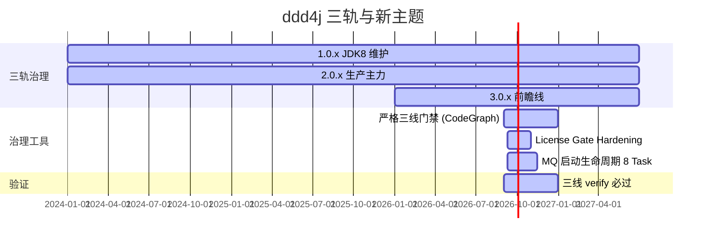

# 5、ddd4j-技术方案与路线

> **文档说明**：ddd4j 当前阶段的工程方案与路线图。覆盖三轨版本治理、MQ 启动生命周期、License Gate Hardening、ArchUnit 边界持续守护四个并行技术方向。每条方案给出选型理由、任务分解、ADR、风险与回滚点。
>
> **版本**：V1.0.0
> **最后更新**：2026-09-18
> **对齐代码 HEAD**：`41f690b7`

---

## 1. 选型总览

| 主题 | 选型 | 主要理由 |
|:---|:---|:---|
| 三轨版本治理 | 1.0.x / 2.0.x / 3.0.x 并行，**核心 SPI 字面级一致** | 业务工程在不同 JDK / Maven / Jackson 栈之间零成本迁移 |
| MQ 启动生命周期 | LIFO 资源关闭 + checkpoint/rollback + 状态机 NEW/STARTING/READY/DEGRADED/FAILED/STOPPED | 必选 listener 失败必须阻断启动；可选失败只摘流量；资源释放幂等 |
| License Gate Hardening | Python `license_policy.py` + SPDX 固定证据 + GitHub tag/commit URL | 取代"正则白名单 + 漂移分支"反模式 |
| 架构边界守护 | 9 条 ArchUnit 规则 | 编译期阻止 Spring / MyBatis / Servlet 反向渗透 core |
| 文档治理 | plan → spec → report 三段式留痕 + CodeGraph 基线 | 与代码同源、可被审计回放 |

## 2. 三轨版本治理（ADR-2026-001）

### 2.1 决策

维持 1.0.x / 2.0.x / 3.0.x 三条主线并行；每条主线都有独立 Maven 版本号与独立 CI。

### 2.2 理由

- 1.0.x 是仍在生产在用的 JDK 8 兼容线（最广生态，最低风险）。
- 2.0.x 是生产主力（JDK 17 + Jackson 2 + jakarta 化迁移中）。
- 3.0.x 是前瞻线（JDK 21 + Maven 4 + Jackson 3），承担"未来 12 个月后"的 2.0.x 替代候选。

### 2.3 约束

1. **核心 SPI 字面级一致**（`ddd4j-core`）：三线 `EventStore` / `CommandBus` / `ProjectionRunner` / `AggregateRoot` 公开签名与行为必须相同。
2. **模块清单字面级一致**（`data` / `web` / `runtime` / `mq` / `auth` 子模块）。
3. **差异必须显式记录**：JDK 字节码 / Jackson 2↔3 / Servlet 3↔Jakarta 迁移属于允许差异；其余差异必须按"必要兼容差异"或"必须修复"语义归类。
4. **HEAD 同步策略**：每个共享修复（MQ durability、Lifecycle 等）必须以同一 commit message 三线同步推送。

### 2.4 路线



## 3. MQ 启动生命周期（ADR-2026-002）

### 3.1 目标

- 必选 MQ 消费者初始化失败 → 阻断应用启动，向上抛 `MQInitializationException`（带 broker/topic/group/listener 上下文）。
- 可选 MQ 消费者失败 → 进入 `DEGRADED`，`ReadinessContributor` 返回 false，K8s 自动摘流量。
- 所有 MQ 客户端关闭幂等，且在单项关闭失败后继续释放其他资源。
- 三线接口、类名、参数、JDK 语法保持一致。

### 3.2 任务分解

| Task | 责任 | 现状 | 风险 |
|:---|:---|:---|:---|
| 1. 核心生命周期与状态对象 | `MQClientLifecycle` / `MQStartupStatus` / `MQStartupState` / `MQListenerInitializationFailure` / `MQInitializationException` / `MQReadinessContributor` | ✅ 完成（41f690b7） | JDK 8 兼容写法；`record` / `List.of` 不可用 |
| 2. Listener `required` 与 `MQClient` 初始化语义 | annotation 加 `required()` 默认 true；`MQListener` 加 9 参数构造器；`MQClient.lifecycle()` / `startupStatus()` default | ✅ 完成 | 破坏旧 8 参数构造器 → 同步加 9 参数兼容构造器 |
| 3. Spring 启动传播 | `MQListenerBeanPostProcessor` 映射 required；`MQListenerRegistrar.destroy()` 幂等；`RuntimeReadinessRegistry` 注册 | ⏳ 计划中 | Spring `ApplicationContextException` 传播路径需写死，不允许 catch+log |
| 4-6. 12 个 broker 适配器生命周期 | Kafka / RabbitMQ / RocketMQ / ActiveMQ / MQTT / Mica / NATS / Pulsar / Redis / SQS / ONS / TDMQ / Disruptor 全部覆盖 `lifecycle()` / `startupStatus()` / `close()` | ⏳ 计划中 | 每个 broker 的资源所有权不同（外部注入 vs 自建）；需逐个区分 |
| 7. 三线同步 | 以 3.0.x 为源同步生产源码；1.0.x 降级到 JDK 8 写法但保持 FQCN/方法/参数 | ⏳ 计划中 | 2.0.x → 3.0.x 已经有 Jackson 2↔3 翻译；JDK 17 写法不能直接下沉到 1.0.x |
| 8. 完整 verify | JDK 8/17/21 + Maven 3/3/4 三线 `clean verify` + Testcontainers broker 关闭与重启验证 | ⏳ 计划中 | Maven 4 在 1.0.x 上不能用；3.0.x `Resolver file-lock` 必须为 0 |

### 3.3 关键实现

```java
// 核心：MQClient.init 内的编排
public default void init(List<MQListener> listeners, MQProperties properties,
                      MQEventSerialization serialization, MQEventStorer storer) {
    if (!properties.isEnabled() || !Objects.equals(properties.getBroker(), impl())) {
        return;
    }
    Logger log = logger();
    MQClientLifecycle lifecycle = lifecycle();
    MQStartupStatus startupStatus = startupStatus();
    int checkpoint = lifecycle.checkpoint();
    startupStatus.starting();

    // 注册配置与依赖到 BaseContext
    BaseContext.inject(MQEvent.MQ_PROPERTIES, properties);
    BaseContext.inject(MQ_SERIALIZATION, serialization);
    if (Objects.nonNull(storer)) {
        BaseContext.inject(MQ_STORER, storer);
    }

    // 1) 初始化生产者；失败 → 抛 + 全局 rollback
    Consumer<MQEvent> producer;
    try {
        producer = initProducer(properties);
    } catch (RuntimeException exception) {
        MQListenerInitializationFailure failure = new MQListenerInitializationFailure(
                impl(), "", "", "producer", true, exception.getClass().getSimpleName());
        startupStatus.failed(failure);
        MQInitializationException initEx = new MQInitializationException(
                failure.broker(), failure.topic(), failure.group(), failure.listenerMethod(), exception);
        try { lifecycle.rollback(checkpoint); }
        catch (RuntimeException rb) { initEx.addSuppressed(rb); }
        throw initEx;
    }

    // 2) 遍历 listener：必选失败阻断启动，可选失败 → DEGRADED
    int success = 0;
    for (MQListener listener : safeListeners(listeners)) {
        int listenerCheckpoint = lifecycle.checkpoint();
        try {
            if (!initConsumer(listener, properties)) {
                throw new IllegalStateException("MQ consumer initialization returned false");
            }
            success++;
        } catch (Exception e) {
            MQListenerInitializationFailure failure = describe(listener, e);
            if (listener.isRequired()) {
                startupStatus.failed(failure);
                MQInitializationException initEx = new MQInitializationException(
                        failure.broker(), failure.topic(), failure.group(), failure.listenerMethod(), e);
                try { lifecycle.rollback(checkpoint); }
                catch (RuntimeException rb) { initEx.addSuppressed(rb); }
                Map<String, Consumer<MQEvent>> pubs = BaseContext.get(MQEvent.MQ_EVENT_PUBLISHER);
                if (Objects.nonNull(pubs) && pubs.remove(impl(), producer) && pubs.isEmpty()) {
                    BaseContext.remove(MQEvent.MQ_EVENT_PUBLISHER);
                }
                throw initEx;
            }
            startupStatus.degraded(failure);
            try { lifecycle.rollback(listenerCheckpoint); }
            catch (RuntimeException rb) { log.warn("Optional MQ listener [{}] rollback failed: {}",
                    listener.getRouteExpression(defaultConcat()), rb.getClass().getSimpleName()); }
            log.warn("Optional MQ listener [{}] initialization failed: {}",
                    listener.getRouteExpression(defaultConcat()), failure.reason());
        }
    }
    startupStatus.ready();
    log.info("MQ [{}] listening {} listener(s)", impl(), success);
}
```

### 3.4 资源关闭（`MQClientLifecycle`）

```java
public synchronized void register(String name, Runnable closeAction) {
    if (!managed) return;
    if (closed.get()) { closeAction.run(); return; }
    resources.push(new Resource(name, closeAction));
}

public synchronized void close() {
    if (!managed || !closed.compareAndSet(false, true)) return;
    closeUntil(0);
}

private void closeUntil(int targetSize) {
    IllegalStateException aggregate = null;
    while (resources.size() > targetSize) {
        Resource resource = resources.pop();
        try { resource.closeAction.run(); }
        catch (RuntimeException exception) {
            if (aggregate == null) aggregate = new IllegalStateException("Failed to close one or more MQ resources");
            aggregate.addSuppressed(new IllegalStateException(resource.name, exception));
        }
    }
    if (aggregate != null) throw aggregate;
}
```

### 3.5 风险与回滚

- **风险**：required 语义若被错误绑定为 false，必选失败被吞 → 启动看似成功但业务消息无人消费。
- **缓解**：`MQEventListener.required()` 默认 `true`；CI 用 contract test 守护 6 个 case（producer 失败 / 必选 false 仍抛 / 必选异常 / 可选失败继续 / publisher 回滚 / 重复 close）。
- **回滚点**：单 commit 关闭 `MQEventListener.required()` 不影响现有 `MQClient` 行为；最大回滚范围为 `ddd4j-mq-core` 一个模块。

## 4. License Gate Hardening（ADR-2026-003）

### 4.1 目标

- 1.0.x、3.0.x 的 SBOM / license 门禁从"白名单正则 + 漂移分支"反模式迁到"精确 `groupId:artifactId:version` + SPDX + 固定官方证据"。
- 2.0.x 同步保持。
- CI 必须直接执行 `verify-license-policy.sh`，**不允许** `continue-on-error` / `-Denforcer.skip`。

### 4.2 任务分解

| Task | 责任 | 现状 |
|:---|:---|:---|
| 1. 可测试的许可证策略引擎 | `scripts/license_policy.py` + 单测 + 保留 `verify-license-policy.sh` 入口 | ⏳ |
| 2. 升级许可证选择证据 schema | TSV 6 列：coordinate / declared_expression / selected_spdx / evidence_url / evidence_type / justification | ⏳ |
| 3. 修复 1.0.x 门禁 | JDK 8 实测：JSQLParser 4.9、Javax Activation/JAXB/EL/Jersey、JNA、JCIP 等 | ⏳ |
| 4. 保持 2.0.x 门禁稳定 | 同步校验器 + schema + 删除陈旧条目 | ⏳ |
| 5. 修复 3.0.x JNA 门禁 | `net.java.dev.jna:jna:5.18.1` 多许可证表达式 + 固定证据；Maven 4 模型门禁 | ⏳ |
| 6. CI 与三线一致性 | `verify.yml` / `release-candidate.yml` 三线并跑；记录 run URL、commit SHA | ⏳ |

### 4.3 关键实现

```python
# 策略判定（伪代码）
def verify_policy(inventory, selections, sbom, build_tool_exclusions):
    violations = []
    for entry in inventory:
        if entry.license in ALLOWED_PERMISSIVE: continue
        if entry.license in EPL_MPL_CDDL_LGPL and entry.packaging == "unmodified-jar":
            if entry.coordinate in selections and has_valid_evidence(selections[entry.coordinate]):
                continue
            violations.append(entry)
            continue
        if entry.license in GPL_AGPL_NONCOMMERCIAL_PROPRIETARY_UNKNOWN:
            violations.append(entry)
    return violations
```

```bash
# 调用
python3 scripts/license_policy.py \
  --inventory "${LICENSE_FILE}" \
  --selections "${SELECTIONS_FILE}" \
  --sbom "${SBOM_FILE}" \
  --build-tool-exclusions "${BUILD_TOOL_EXCLUSIONS_FILE}"
```

### 4.4 风险与回滚

- **风险**：若 TSV 缺少某个真实依赖的证据，CI 立即变红；可能阻塞 hotfix。
- **缓解**：分线分阶段门禁（先 1.0.x 跑稳 → 推 2.0.x → 推 3.0.x），不在同一 PR 跨线。
- **回滚点**：单个 TSV 行回滚 = 删除该行 + 把对应依赖升级或替换的 PR 单独发；不允许"加宽白名单"绕过。

## 5. ArchUnit 边界持续守护（ADR-2026-004）

### 5.1 目标

把 9 条 ArchUnit 规则从"CI 报红"升级为"PR 报告里同时显示规则名 + 违反文件 + 修复建议"。

### 5.2 关键规则

| 规则 | 保护 | 风险 |
|:---|:---|:---|
| `no_autoconfiguration_in_ddd4j` | ddd4j 永远不是 Spring Boot starter | 如果放开 → 上游业务工程会被迫锁死 Spring 生态 |
| `no_spring_in_core_modules` | core 永远可被非 Spring 容器复用 | 一旦反向依赖，业务模型无法脱离 Spring |
| `no_spring_messaging_in_mq_core` | mq-core 永远 broker 无关 | 一旦反向，mq-core 失去"被 8 运行时共享"的能力 |
| `core_no_mybatis` | 业务模型不绑 ORM | MyBatis-Plus 演进不再倒灌 ddd4j |

### 5.3 实施

- 把规则集抽到 `ddd4j-ddd-rules-clean` 模块；每个模块的 surefire 引入对应 ArchUnit 测试。
- CI 把"通过/失败"做成可下载的 ArchUnit HTML 报告。

## 6. 公共决策记录（ADR 索引）

| ADR | 主题 | 决策 | 状态 |
|:---|:---|:---|:---|
| ADR-2026-001 | 三轨版本治理 | 1.0.x / 2.0.x / 3.0.x 并行；core SPI 字面级一致 | ✅ 采纳 |
| ADR-2026-002 | MQ 启动生命周期 | LIFO + checkpoint/rollback + 6 状态机 + required 默认 true | 🔧 实施中（Task 1-2 完成，3-8 进行中） |
| ADR-2026-003 | License Gate Hardening | Python `license_policy.py` + SPDX 固定证据 | 🔧 实施中 |
| ADR-2026-004 | ArchUnit 边界 | 9 条规则编译期强制 + HTML 报告 | ✅ 采纳 |
| ADR-2026-005 | Outbox 投递 | bounded ack timeout + bounded channel pool（替代 ThreadLocal） | ✅ 已落地（41f690b7 / 3344af38） |
| ADR-2026-006 | 文档治理 | plan → spec → report 三段式 + CodeGraph 基线 | ✅ 采纳 |

## 7. 关键里程碑

```mermaid
gantt
    title 2026-Q4 关键里程碑
    dateFormat  YYYY-MM-DD
    section MQ 启动生命周期
    Task 3 Spring 启动传播         :milestone, 2026-09-25
    Task 4-6 适配器覆盖            :milestone, 2026-10-15
    Task 7 三线同步                :milestone, 2026-11-05
    Task 8 verify 全绿             :milestone, 2026-11-15
    section License Gate
    Task 1-2 引擎+schema             :milestone, 2026-09-25
    Task 3 1.0.x 跑绿              :milestone, 2026-10-10
    Task 5 3.0.x JNA              :milestone, 2026-10-20
    Task 6 CI 一致性              :milestone, 2026-10-31
    section 三线治理
    2026-09 严格门禁基线             :done, 2026-09-09
    2026-12 持续三线门禁             :milestone, 2026-12-31
```

## 8. 风险与回滚总览

| 主题 | 风险 | 回滚点 |
|:---|:---|:---|
| MQ 启动生命周期 | required 默认 true 阻断启动 | 单 commit 关闭 `MQEventListener.required()` |
| License Gate | TSV 缺证据导致 hotfix 被卡 | 单 TSV 行回滚 + 依赖升级单独 PR |
| 三线同步 | 2.0.x / 3.0.x 已经 0 diff；若 1.0.x 引入新差异会被发现 | 1.0.x 单 commit 回滚；Stage E 整合动作由 1.0.x 主导，2.0.x/3.0.x cherry-pick |
| Maven 4 | 3.0.x 单线 Maven 4；插件不兼容 | 切回 Maven 3 仅 3.0.x；plugin 单独升级 PR |

## 9. 相关文档

- [`8、ddd4j-Architecture.zh_CN.md`](./8、ddd4j-Architecture.zh_CN.md) · 系统架构
- [`7、ddd4j-领域模型设计.md`](./7、ddd4j-领域模型设计.md) · 领域模型
- [`1.0.x/8、ddd4j-1.0.x-Architecture.zh_CN.md`](./1.0.x/8、ddd4j-1.0.x-Architecture.zh_CN.md) · 1.0.x 版本架构 + 三线差异表
- [`docs/superpowers/plans/2026-09-10-mq-startup-lifecycle.md`](./docs/superpowers/plans/2026-09-10-mq-startup-lifecycle.md) · MQ 启动生命周期实施计划
- [`docs/superpowers/plans/2026-09-10-license-gate-hardening.md`](./docs/superpowers/plans/2026-09-10-license-gate-hardening.md) · License Gate Hardening 实施计划
- [`docs/superpowers/reports/2026-09-09-three-line-source-parity-audit.md`](./docs/superpowers/reports/2026-09-09-three-line-source-parity-audit.md) · 三线严格审计报告

---

**文档版本**：V1.0.0
**创建日期**：2026-09-18
**最后更新**：2026-09-18
**文档状态**：✅ 待评审