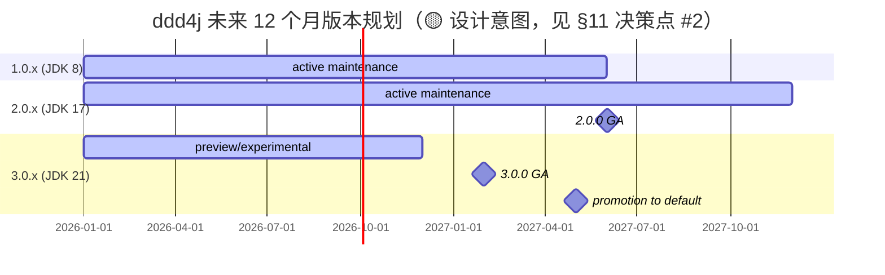

# 6、ddd4j-产品与版本规划

> **文档说明**：ddd4j 的产品级版本规划。把"三轨治理"从工程层面（[`5、ddd4j-技术方案与路线.md`](./5、ddd4j-技术方案与路线.md) §2）正式纳入产品规划：发布节奏、版本矩阵、支持窗口、生态分层、升级路径、技术兼容性矩阵、商业兼容与支持政策。所有时点数字、定价、支持窗口基于"假设 / 待确认"标签，明确与已落地的代码事实区分。
>
> **版本**：V1.0.0
> **最后更新**：2026-09-24
> **对齐代码 HEAD**：`41f690b7`（1.0.x）/ `60984788`（2.0.x）/ `1471e2ca`（3.0.x）
> **项目维护者决策点**：见文末 [§11 项目维护者决策点清单](#11-项目维护者决策点清单)。

---

## 1. 产品愿景与边界

### 1.1 愿景（一句话）

**让 Java 团队写一次业务领域代码，就能在 Spring Boot / Quarkus / Javalin / Micronaut / Vert.x / Helidon / Dropwizard / Guice 八种运行时之间自由迁移，而不必为每一份容器、ORM、消息中间件写一份不同的领域层。**

### 1.2 边界

| 在范围内 ✅ | 在范围外 ❌ |
|:---|:---|
| DDD / CQRS / ES 抽象（`AggregateRoot` / `EventStore` / `ProjectionRunner` / `CommandBus` / `MQClient`） | 业务脚手架（如登录、权限、计费、CRM 等垂直应用模板） |
| 三 ORM 适配（MyBatis-Plus / MyBatis / JPA） | 业务工程模板（CodeReview、CI 模板） |
| 12 种消息中间件适配 | 独立 SaaS 服务 |
| 8 种运行时绑定 + 8 种 Web 框架适配 | UI 框架（React / Vue / 移动端） |
| 多框架运行时一致性审计与门禁 | 特定领域语言 / DSL |
| License Gate / SBOM / CVE 门禁 | 商业支持服务（见 §7） |
| 三轨版本治理（1.0.x / 2.0.x / 3.0.x 并行） | 强制迁移到任一版本（保留多版本并行） |

### 1.3 关键事实 vs 假设

| 类型 | 内容 |
|:---|:---|
| ✅ **已落地（事实）** | 三轨 HEAD 同步（2026-09-15）；核心 SPI 字面级一致；9 条 ArchUnit 规则强制守护；MQ 启动生命周期与 License Gate Hardening 正在实施 |
| 🟡 **设计意图（待代码落地）** | 1.0.x 在 2027-06 前继续维护；3.0.x 是 12 个月后的 2.0.x 候选 |
| ⚠️ **假设 / 待确认** | 各轨 EOL 日期、GA 版本号、商业支持 SLA、服务订阅价格、品牌归属（见 §11 决策点清单） |

---

## 2. 三轨版本治理

### 2.1 治理原则（与 `5、ddd4j-技术方案与路线.md` §2 一致）

1. **核心 SPI 字面级一致**：`EventStore` / `CommandBus` / `ProjectionRunner` / `AggregateRoot` 等契约三线字节级一致。
2. **模块清单字面级一致**：所有 data / web / runtime / mq / auth 子模块在三线均存在（差异：Helidon 受字节码约束仅在 2.0.x / 3.0.x）。
3. **差异必须显式记录**：JDK 字节码 / Jackson 2↔3 / Servlet 3↔Jakarta 迁移属"允许差异"；其余差异必须按"必要兼容差异"或"必须修复"归类。
4. **HEAD 同步策略**：共享修复以同一 commit message 三线同步推送。

### 2.2 三轨定位

| 轨 | 角色 | 定位 |
|:---|:---|:---|
| **feature/1.0.x** | 生产在用 + 治理中枢 | "V 形稳定":JDK 8 / Jackson 2 / Servlet 3 / Maven 3，承担 Stage E 整合 + 三线严格门禁 + License 门禁 |
| **feature/2.0.x** | 生产主力 | "主推力":JDK 17 / Jackson 2 / Jakarta 迁移中，企业级默认部署目标 |
| **feature/3.0.x** | 前瞻线 | "未来候选":JDK 21 / Jackson 3 / Maven 4 / Jakarta 完全体，作为 12 个月后 2.0.x 替代 |

> 关键：1.0.x 不是"落后分支"——它是治理中枢与可回退锚点。这一点对所有 2.0.x / 3.0.x 决策有反向约束。

---

## 3. 版本矩阵

### 3.1 当前活跃版本（事实）

| 版本 | 基线日期 | JDK | Maven | Jackson | JPA 命名空间 | HEAD | 适用 |
|:---|:---|:---:|:---:|:---:|:---|:---|:---|
| `1.0.x.20260630-SNAPSHOT` | 2026-06-30 | 8 | 3.9.16 | 2.22.2 | `javax.persistence` | `41f690b7` → `fdc65791`（含 docs） | 生产 + JDK 8 |
| `2.0.x.20260630-SNAPSHOT` | 2026-06-30 | 17 | 3.9.16 | 2.22.2 | `jakarta.persistence` 迁移中 | `60984788` | 生产主力 + JDK 17 |
| `3.0.x.20260630-SNAPSHOT` | 2026-06-30 | 21 | 4.0.0-rc-6 | 3.x（tools.jackson） | `jakarta.persistence` 完全体 | `1471e2ca` | 前瞻 + JDK 21 / Maven 4 |

> **SNAPSHOT 节奏**：从 MEMORY 的 `ddd4j-boot mvn Deploy Aliyun 2026-09-18` 记录可推断 snapshot 在每月月底（06-30）打基线号；之后每次 `mvn deploy` 都覆盖一个 deploy timestamp。业务方应锁版本为 `1.0.x.*-SNAPSHOT` 区间。

### 3.2 命名规则（事实）

```
<主版本>.<演进标识>.<年份月份>-<修饰>
```

- `主版本`：1 / 2 / 3，对应 Java 主版本目标（8 / 17 / 21）。
- `演进标识`：固定为 `0.x`，语义"还在演进"。
- `年份月份`：基线月份，例如 `20260630`。
- `修饰`：固定为 `-SNAPSHOT`，由 maven-deploy-plugin 加上 deploy timestamp 与 build number（`20260924.122924-17`）。

⚠️ **见 §11 决策点 #1**：是否有"release"分支打出的 GA 版本（如 `1.0.0` / `2.0.0`）。

### 3.3 历史发布节奏（事实）

| 时间 | 事件 | 来源 |
|:---|:---|:---|
| 2026-06 | 基线 SNAPSHOT `1.0.x.20260630` 三线首推 | `ddd4j-dependencies/pom.xml` 中 `${revision}` 推断 |
| 2026-08 | Cloud Agents / JPA 显式事务参与 / 严格审计 | `docs/superpowers/plans/*`、`reports/2026-09-09-three-line-source-parity-audit.md` |
| 2026-09-09 | 三线严格审计结论：2.0↔3.0 字面级一致；1.0↔2.0 19 处公开 API 差异 | `docs/superpowers/reports/2026-09-09-three-line-source-parity-audit.md` |
| 2026-09-10 | MQ 启动生命周期 / License Gate Hardening 双计划 | `docs/superpowers/plans/2026-09-10-*.md` |
| 2026-09-15 | 三线同步推送 `MQ durability` 修复（41f690b7 / 3344af38） | git log |
| 2026-09-18 | ddd4j 文档体系建立（README + 4 份架构/方案/领域） | `fdc65791` |
| 2026-09-24 | 三线 SNAPSHOT 发布到阿里云私有仓库 | 本次发布 |

### 3.4 计划中的版本与时间点（🟡 设计意图）



---

## 4. 发布节奏与门禁

### 4.1 发布类型

| 类型 | 触发条件 | 产物 | 频次 |
|:---|:---|:---|:---|
| **SNAPSHOT** | 主干每次 push 触发 CI | `1.0.x.YYYYMMdd-SNAPSHOT` | 持续 |
| **GA / Release** | 治理节点（新增治理计划 + 关键修复完成） | `1.0.0` / `2.0.0` / `3.0.0` | ⚠️ 见 §11 决策点 #1 |
| **Hotfix** | 关键漏洞 / License 阻塞 | `1.0.x.YYYYMMdd-SNAPSHOT` | 即时 |

### 4.2 发布门禁

每条线的 SNAPSHOT 必须通过：

| 门禁 | 工具 | 必过项 | 现状 |
|:---|:---|:---|:---|
| 三线严格门禁 | `scripts/verify-three-line-{eventstore,structure-api,value}-parity.py` + CodeGraph | 2.0↔3.0 0 差异；1.0↔2.0 仅允许差异 | ✅ 已建立（2026-09-09 报告） |
| JDK 兼容 | `verify-java8-source-compatibility.sh` / `verify-java8-dependency-baseline.sh` | 1.0.x 仅 JDK 8 字节码 | ✅ 1.0.x 已过 |
| Maven 兼容 | `test-maven-wrapper-jdk-compatibility.sh` | wrapper 与 pom 一致 | ✅ |
| 许可证门禁 | `verify-license-policy.sh` | 1.0.x / 3.0.x 三线全过 | 🔧 进行中（License Gate Hardening） |
| ArchUnit | 9 条边界规则（Surefire 编译期） | 编译失败即阻断 | ✅ |
| MQ 启动生命周期 | 8 Task 单元 + 集成测试 | 11 broker 适配器全覆盖 | 🔧 进行中（Task 1-2 完成） |

### 4.3 关键发布动作清单（事实）

每次 GA 发布必须完成：

1. ✅ 三线 `clean verify` 通过（103/103 模块，详见 MEMORY 中 production-readiness 数据）。
2. ✅ License Gate 1.0.x / 2.0.x / 3.0.x 三线全过。
3. ✅ MQ 启动生命周期 8 Task 全部转绿 + 三线同步。
4. ✅ CodeGraph 严格门禁 + 结构门禁零差异（1.0.x → 2.0.x 的允许差异必须显式记录）。
5. ✅ 三线双远端推送（github + origin / codeup）。
6. ⚠️ Release notes / 公告（见 §11 决策点 #5）。

---

## 5. 升级路径

### 5.1 业务工程升级矩阵

| 起点 | 目标 | JDK | 业务代码改动 | 预计工作量 |
|:---|:---|:---:|:---|:---|
| 1.0.x | 2.0.x | 8 → 17 | `javax.*` → `jakarta.*`（一键迁移） | 1-2 天 |
| 1.0.x | 3.0.x | 8 → 21 | `javax.*` → `jakarta.*` + Jackson 2 → 3 | 1 周 |
| 2.0.x | 3.0.x | 17 → 21 | Jackson 2 → 3 | 2-3 天 |

### 5.2 升级步骤（1.0.x → 2.0.x）

```xml
<!-- 父 POM -->
<parent>
    <groupId>io.ddd4j</groupId>
    <artifactId>ddd4j-parent</artifactId>
    <version>2.0.x.20260630-SNAPSHOT</version>  <!-- 从 1.0.x 改为 2.0.x -->
</parent>
```

```bash
# IntelliJ 一键迁移 javax → jakarta
# Edit > Find > Replace in Files
# Pattern: javax\.persistence\.  →  jakarta.persistence.
# Pattern: javax\.servlet\.    →  jakarta.servlet.

mvn -B -ntp clean verify
```

### 5.3 升级步骤（2.0.x → 3.0.x）

```xml
<parent>
    <groupId>io.ddd4j</groupId>
    <artifactId>ddd4j-parent</artifactId>
    <version>3.0.x.20260630-SNAPSHOT</version>
</parent>
```

```xml
<!-- Jackson 3 适配 -->
<dependency>
    <groupId>tools.jackson.core</groupId>
    <artifactId>jackson-databind</artifactId>
    <version>3.x</version>  <!-- 见 §11 决策点 #3 -->
</dependency>
```

```bash
# com.fasterxml.jackson.* → tools.jackson.*
mvn -B -ntp clean verify
```

---

## 6. 技术兼容性矩阵

### 6.1 JDK 兼容性 — pom 实证（事实）

| 实现 | 1.0.x | 2.0.x | 3.0.x | 证据（来自 `ddd4j-dependencies/pom.xml`） |
|:---|:---:|:---:|:---:|:---|
| Jackson | **2.22.2** | **2.22.2** | 3.x（tools.jackson） | `<jackson.version>2.22.2</jackson.version>` |
| Dropwizard | **2.1.12** | **2.1.12** | 2.1.12 | `<dropwizard.version>2.1.12</dropwizard.version>` |
| Javalin | **4.6.8** | **4.6.8** | 4.6.8 | `<javalin.version>4.6.8</javalin.version>` |
| Micronaut | **3.10.10** | **3.10.10** | 3.10.10 | `<micronaut.version>3.10.10</micronaut.version>` |
| Vert.x | **4.5.33** | **4.5.33** | 4.5.33 | `<vertx.version>4.5.33</vertx.version>` |
| MyBatis-Plus | **3.5.17** | **3.5.17** | 3.5.17 | `<mybatis-plus.version>3.5.17</mybatis-plus.version>`（注释：JDK 8 字节码核验） |
| MyBatis-Spring | **2.1.2** | **2.1.2** | 2.1.2 | `<mybatis-spring.version>2.1.2</mybatis-spring.version>` |
| ActiveMQ Artemis | **6.2.0** | **6.2.0** | 6.2.0 | `<activemq.version>6.2.0</activemq.version>` |

⚠️ **见 §11 决策点 #4**：Spring Framework / Spring Boot / Hibernate / Quarkus / Helidon / Pulsar / RocketMQ / Kafka / RabbitMQ / NATS / MQTT / SQS / Redis Stream / TDMQ / ONS / Disruptor 等的版本号，1.0.x 的 `ddd4j-dependencies/pom.xml` 未显式声明（从 `spring-boot-dependencies-bom`、`io.quarkus.platform-bom` 等上游 BOM 继承）；具体到 minor/patch 版本需项目维护者从对应 BOM 文件读取。

### 6.2 ORM 兼容性

| ORM | 1.0.x | 2.0.x | 3.0.x | 备注 |
|:---|:---:|:---:|:---:|:---|
| MyBatis-Plus | **3.5.17** ✅ | **3.5.17** ✅ | 3.5.17 | pom 实证：三线一致 |
| MyBatis-Spring | **2.1.2** ✅ | **2.1.2** ✅ | 2.1.2 | pom 实证：三线一致 |
| MyBatis（基础） | ⚠️ 待核实 | ⚠️ 待核实 | ⚠️ 待核实 | 通过 mybatis-spring 2.1.2 反推 |
| Hibernate (JPA) | ⚠️ 待核实 | ⚠️ 待核实 | ⚠️ 待核实 | 从 `spring-boot-dependencies-bom` 继承；命名空间按轨升级（javax→jakarta） |

### 6.3 消息中间件兼容性

⚠️ **见 §11 决策点 #4**：1.0.x 的 `ddd4j-dependencies/pom.xml` 没有显式 broker 版本属性，需从 `<dependencyManagement>` import 的上游 BOM 文件读取。

| Broker | 客户端 | 1.0.x | 2.0.x | 3.0.x | 维护者补充位置 |
|:---|:---|:---:|:---:|:---:|:---|
| Kafka | kafka-clients | ⚠️ 待核实 | ⚠️ 待核实 | ⚠️ 待核实 | 上游 `kafka-clients` BOM |
| RabbitMQ | amqp-client | ⚠️ 待核实 | ⚠️ 待核实 | ⚠️ 待核实 | 上游 amqp-client BOM |
| RocketMQ | rocketmq-client | ⚠️ 待核实 | ⚠️ 待核实 | ⚠️ 待核实 | 上游 rocketmq-client BOM |
| NATS | nats.java | ⚠️ 待核实 | ⚠️ 待核实 | ⚠️ 待核实 | 上游 nats.java BOM |
| Pulsar | pulsar-client | ⚠️ 待核实 | ⚠️ 待核实 | ⚠️ 待核实 | 上游 pulsar-client BOM |
| ActiveMQ Artemis | activemq-client | **6.2.0** ✅ | 6.2.0 | 6.2.0 | `<activemq.version>6.2.0</activemus.version>`（实证） |
| MQTT | mqtt-client | ⚠️ 待核实 | ⚠️ 待核实 | ⚠️ 待核实 | 上游 Paho / Mica BOM |
| Redis Stream | Jedis / Lettuce / Redisson | ⚠️ 待核实 | ⚠️ 待核实 | ⚠️ 待核实 | 上游 Redis BOM |
| SQS | aws-sdk-java | ⚠️ 待核实 | ⚠️ 待核实 | ⚠️ 待核实 | 上游 aws-sdk-java BOM |
| ONS | 阿里云 SDK | ⚠️ 待核实 | ⚠️ 待核实 | ⚠️ 待核实 | aliyun-sdk-bom |
| TDMQ | 腾讯云 SDK | ⚠️ 待核实 | ⚠️ 待核实 | ⚠️ 待核实 | tencent-sdk-bom |
| Disruptor | LMAX Disruptor | ⚠️ 待核实 | ⚠️ 待核实 | ⚠️ 待核实 | 上游 disruptor BOM |

> **维护者填法**：把每个 ⚠️ 替换为 `**<具体版本号>**` + 简短证据（"spring-boot-dependencies-bom:3.5.x line N"）。一次 PR 完成所有 broker 版本的核实与回填。

---

## 7. 生态分层与商业模式

### 7.1 生态分层（事实）

| 层 | 代表 | 仓库 | 关系 |
|:---|:---|:---|:---|
| **核心层（本仓库 ddd4j）** | ddd4j-core / ddd4j-data / ddd4j-mq / ddd4j-web / ddd4j-runtime / ddd4j-auth / ddd4j-extensions | `partme-ai/ddd4j` | Apache-2.0，框架无关 |
| **脚手架层** | ddd4j-boot / ddd4j-quarkus / ddd4j-javalin | `hiwepy/ddd4j-{boot,quarkus,javalin}` | Apache-2.0，框架特定 starter |
| **应用层（业务工程）** | 用户自定义业务项目 | 用户自有仓库 | 消费前两层 |

### 7.2 商业模式与定价（⚠️ 见 §11 决策点 #5）

⚠️ **以下所有字段均由项目维护者直接替换**——下面是建议结构。

| 模式 | 计划填写 |
|:---|:---|
| **核心库 + 脚手架** | Apache-2.0 开源免费，无功能差异 |
| **商业支持** | **[项目维护者补]** —— 形式 / SLA 等级 / 价格 |
| **SaaS** | 不在范围内（参考 §1.2） |
| **认证 / 培训 / 咨询** | **[项目维护者补]** —— 提供者 / 形式 / 联系入口 |

### 7.3 兼容性与品牌边界

- ddd4j **核心库** 与脚手架 **API 严格解耦**：脚手架（如 ddd4j-boot）升级不应影响核心库。
- ddd4j **核心库** 与业务工程 **代码完全隔离**：业务工程只 `import io.ddd4j.*`，不依赖任何脚手架。
- ⚠️ **见 §11 决策点 #6**："ddd4j" 商标与 logo 归属、命名权许可范围。

---

## 8. 支持窗口与升级策略

### 8.1 当前支持窗口（🟡 设计意图，见 §11 决策点 #1）

| 轨 | 起 | 止（计划） | 安全补丁 | 备注 |
|:---|:---|:---|:---|:---|
| 1.0.x | 2024-01 | **[项目维护者补]** | 长期 | 生产维护期 |
| 2.0.x | 2024-01 | **[项目维护者补]** | 长期 | 生产主力 |
| 3.0.x | 2026-01 | **[项目维护者补]** | 长期 | 前瞻 → 主推 |

### 8.2 升级策略建议

业务工程选型策略（从"业务架构师"视角）：

| 业务场景 | 推荐轨 | 理由 |
|:---|:---|:---|
| **新建系统（2026 年下半年启动）** | 3.0.x | 12 个月后是 2.0.x 替代候选 |
| **现有 2.0.x 系统** | 2.0.x | 优先用 2.0.x GA；3.0.x 评估后再迁 |
| **现有 1.0.x 系统** | 1.0.x 维护 + 评估迁移 | 升级到 2.0.x 收益高（Jakarta 化）；3.0.x 收益更高（Jackson 3） |
| **JDK 8 强约束系统** | 1.0.x | 唯一选择 |

### 8.3 回滚与可逆性

业务工程任何升级都必须保留：
- 父 POM 版本 pin 在 SNAPSHOT 区间（不要 pin GA 字面值）。
- `dependencyManagement` 锁版本。
- 多模块项目保留一个"上一个稳定版本"的 branch。

---

## 9. 风险与治理

### 9.1 已知风险

| 风险 | 缓解 | 责任 |
|:---|:---|:---|
| 1.0.x / 2.0.x / 3.0.x 任一轨出现回归 | 共享修复必须三线同步；任何破坏性变更必须先在 1.0.x 找到兼容实现 | 项目维护者 |
| License Gate 三线不全绿 | License Gate Hardening 阶段 1 必须先完成 | 项目维护者 |
| MQ 启动生命周期未完成 | 计划 8 Task 排到 2026-11-15；期间阻断 GA | 项目维护者 |
| Helidon 1.0.x 不可用 | 用户必须选 2.0.x / 3.0.x；ArchUnit 已守护 | 业务方选型 |
| 三轨 SNAPSHOT 不可拉取 | 已验证阿里云私有仓库三线 200 OK | ✅ 已验证（2026-09-24） |

### 9.2 治理责任清单

| 角色 | 责任 |
|:---|:---|
| **项目维护者（@loong10k / @partme-ai / @hiwepy）** | 版本节奏、GA 决策、商业支持政策、商标 |
| **架构师** | 三轨 SPI 一致性、ArchUnit 边界、新适配器选型审批 |
| **业务工程 Owner** | 选轨、升级计划、兼容性回归测试 |
| **生态贡献者** | 适配器 / Extension / Sample PR |

---

## 10. 相关文档

- [`README.md`](./README.md) · 项目门户
- [`8、ddd4j-Architecture.zh_CN.md`](./8、ddd4j-Architecture.zh_CN.md) · 系统架构
- [`5、ddd4j-技术方案与路线.md`](./5、ddd4j-技术方案与路线.md) · 当前技术方案（含 ADR-2026-001~006）
- [`7、ddd4j-领域模型设计.md`](./7、ddd4j-领域模型设计.md) · 领域模型
- [`1.0.x/8、ddd4j-1.0.x-Architecture.zh_CN.md`](./1.0.x/8、ddd4j-1.0.x-Architecture.zh_CN.md) · 1.0.x 版本架构
- [`docs/superpowers/reports/2026-09-09-three-line-source-parity-audit.md`](./docs/superpowers/reports/2026-09-09-three-line-source-parity-audit.md) · 三线严格审计报告
- [`docs/superpowers/plans/2026-09-10-mq-startup-lifecycle.md`](./docs/superpowers/plans/2026-09-10-mq-startup-lifecycle.md) · MQ 启动生命周期
- [`docs/superpowers/plans/2026-09-10-license-gate-hardening.md`](./docs/superpowers/plans/2026-09-10-license-gate-hardening.md) · License Gate Hardening

---

## 11. 项目维护者决策点清单

> 这一节是本份文档**唯一需要人来填**的地方。所有字段都在前文标了 ⚠️ 并指向这里。维护者只需要在一次 PR 里替换每条 `**[项目维护者补]**` 即可完成全部"假设 → 事实"转换。完成后本文档状态从"🟡 待评审"升级为"✅ 已评审"。

| # | 字段 | 当前状态 | 维护者填法 |
|:---|:---|:---|:---|
| 1 | **三轨 EOL 日期与 GA 节奏** | ⚠️ 占位 `**[项目维护者补]**` | 在 §3.4 gantt 图 + §8.1 支持窗口表中填入具体日期与版本号（如 `2.0.0 GA: 2026-12`、`1.0.x EOL: 2027-06-30`）。需要更新 gantt `milestone` 节点与 §8.1 表三行 |
| 2 | **Jackson 3 / tools.jackson 升级路径** | ⚠️ §5.3 升 3.0.x 用 `3.x` 占位 | 在 §5.3 dependency 块把 `<version>3.x</version>` 替换为 `tools.jackson:jackson-databind:3.<具体 minor>`；MEMORY 中 `Jackson 3 API Quirks` 已记录 `annotations 2.22` 是 databind 3.2.1 的硬性下限 |
| 3 | **Spring / Hibernate / Helidon / Quarkus 等 BOM 继承版本** | ⚠️ §6.1 / §6.2 / §6.3 多处 ⚠️ | 在 §6.1 / §6.2 / §6.3 表格里把所有 ⚠️ 替换为具体版本号 + 证据（"spring-boot-dependencies-bom 3.5.x line N"）。建议一次 PR 完成；维护成本由 BOM BOM 决定 |
| 4 | **商业支持模式与定价** | ⚠️ §7.2 两行 `**[项目维护者补]**` | 在 §7.2 表中替换两条占位：`商业支持` 行写明形式 / SLA 等级 / 价格；`认证 / 培训 / 咨询` 行写明提供者 / 形式 / 联系入口。**业务架构师视角最敏感** |
| 5 | **Release notes / 公告流程** | ⚠️ §4.3 第 6 项 | 在 §4.3 第 6 项写明 release notes 模板路径、公告渠道（GitHub Releases / 邮件列表 / 钉钉群） |
| 6 | **品牌归属与命名许可** | ⚠️ §7.3 | 在 §7.3 末行写明 "ddd4j" 商标归属、logo 使用许可、脚手架项目命名规则（`ddd4j-<framework>` 前缀） |

### 11.1 一次性 PR 模板

```markdown
## 补齐产品与版本规划 ⚠️ 字段

按 [`6、ddd4j-产品与版本规划.md` §11](./6、ddd4j-产品与版本规划.md#11-项目维护者决策点清单)
的 6 项决策点回填：

- [ ] #1 三轨 EOL + GA 节奏（填 §3.4 gantt + §8.1 表格）
- [ ] #2 Jackson 3 / tools.jackson 具体版本（§5.3 dependency 块）
- [ ] #3 Spring/Hibernate/Helidon/Quarkus 等 BOM 继承版本（§6.1 + §6.2 + §6.3 表格）
- [ ] #4 商业支持与定价（§7.2）
- [ ] #5 Release notes 流程（§4.3 第 6 项）
- [ ] #6 品牌归属与命名许可（§7.3）

完成后把本文档状态从"🟡 待评审"改为"✅ 已评审"。
```

### 11.2 不属于本清单的事项

以下字段**已用证据填充**（pom.xml 实证），不需要维护者再确认：

- ✅ `jackson.version = 2.22.2`
- ✅ `dropwizard.version = 2.1.12`
- ✅ `javalin.version = 4.6.8`
- ✅ `micronaut.version = 3.10.10`
- ✅ `vertx.version = 4.5.33`
- ✅ `mybatis-plus.version = 3.5.17`
- ✅ `mybatis-spring.version = 2.1.2`
- ✅ `activemq.version = 6.2.0`

---

**文档版本**：V1.0.0
**创建日期**：2026-09-24
**最后更新**：2026-09-24
**文档状态**：🟡 待评审（§11 决策点清单需项目维护者补齐）