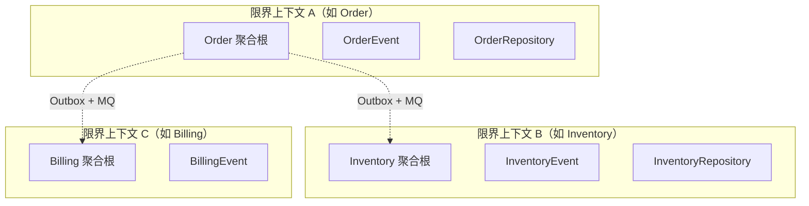
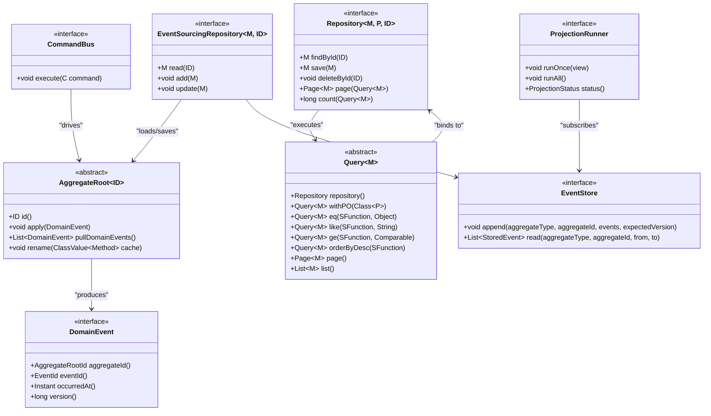
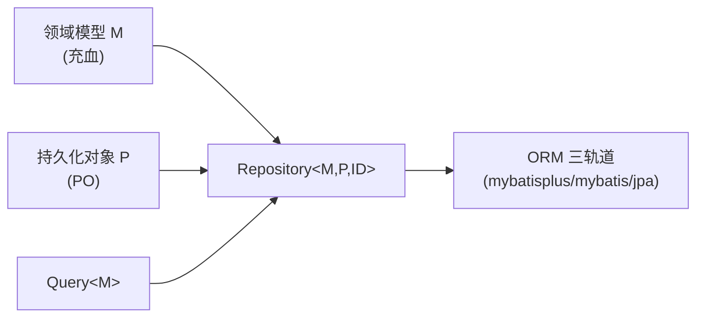
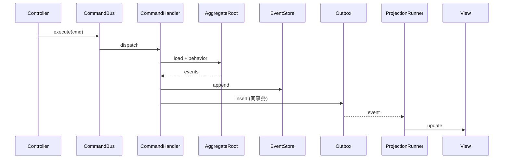
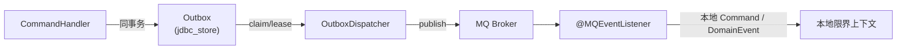
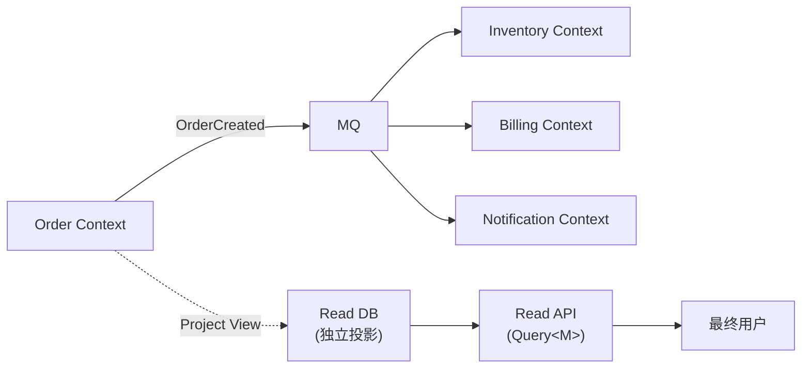

# 7、ddd4j-领域模型设计

> **文档说明**：ddd4j 提供的领域抽象与契约。覆盖战术设计要素（聚合、实体、值对象、领域事件、仓储、查询）、CQRS 抽象（Command / View / Projection）、EventStore 抽象、上下文边界与跨进程事件契约。
>
> **版本**：V1.0.0
> **最后更新**：2026-09-18
> **对齐代码 HEAD**：`41f690b7`

---

## 1. 战略层面：ddd4j 不锁定限界上下文

ddd4j 是一个**通用基础层**，不预设任何限界上下文（bounded context）。它提供**战术模式 + 契约**：

- 业务工程在 `ddd4j-core` 之上**自己**划分限界上下文。
- 限界上下文之间通过**领域事件 + Outbox + MQ** 实现最终一致的跨进程集成。
- 同一限界上下文内，**一个进程 = 一种运行时**（不混 Spring + Quarkus）。



## 2. 战术层面：ddd4j-core 提供的 DDD 构件



### 2.1 `AggregateRoot<ID>`（`ddd4j-core`）

聚合根是**所有写路径的入口**。它通过 `@EventHandler` 注解或 `on<EventType>` 命名约定（3.0.x 兼容）来应用领域事件，并维护 `pullDomainEvents()` 留给仓储/Outbox 同步。

```java
public class Order extends AggregateRoot<Long> {

    private final Long id;
    private String buyerName;

    public Order(Long id, String buyerName) {
        this.id = id;
        renameBuyer(buyerName);
    }

    @Override
    public Long id() { return id; }

    public void renameBuyer(String buyerName) {
        if (StrKit.isBlank(buyerName)) {
            throw new IllegalArgumentException("buyerName must not be blank");
        }
        this.buyerName = buyerName;
    }
}
```

**关键约束**：1.0.x 适配器写法（无 `List.of`、无 pattern variable），2.0/3.0 同样契约。

### 2.2 `DomainEvent`

```java
public interface DomainEvent {
    AggregateRootId aggregateId();
    EventId eventId();
    Instant occurredAt();
    long version();
}
```

事件是不可变值对象。三轨统一在 `io.ddd4j.core.ddd.event` 包。

### 2.3 `Repository<M, P, ID>`（充血 + PO 双层模型）

- `M` = 领域模型（充血）
- `P` = 持久化对象（PO）
- `ID` = 主键

业务层只引用 `M`；基础设施层使用 `P`。`Query<T>` 是充血查询的统一入口。



### 2.4 `EventStore`

```java
public interface EventStore {
    void append(String aggregateType, AggregateRootId aggregateId,
                List<? extends DomainEvent<?>> events, long expectedVersion);
    List<StoredEvent> read(String aggregateType, AggregateRootId aggregateId,
                            long fromVersion, long toVersion);
}
```

5 个实现（JPA / JDBI / R2DBC / ESDB / Panache）。`EventPayloadSerializer`（`io.ddd4j.core.cqrs.eventstore.jackson`）负责 payload 序列化；三线用 Jackson 2 或 Jackson 3 翻译。

### 2.5 `CommandBus` 与 `ProjectionRunner`



## 3. CQRS 抽象

| 抽象 | 位置 | 含义 |
|:---|:---|:---|
| `Command` | `io.ddd4j.core.cqrs.command` | 不可变命令对象 |
| `CommandHandler<C>` | 同上 | 处理单个命令 |
| `CommandBus` | 同上 | 路由命令到 handler（4 个 runtime 实现） |
| `Query<M>` | `io.ddd4j.core.cqrs.query` | 充血查询构建器 |
| `View` | `io.ddd4j.core.cqrs.readmodel` | 读模型视图 |
| `ProjectionRunner` | 同上 | 增量更新视图 |
| `ProjectionPosition` | 同上 | 增量位置管理 |
| `ProjectionStatus` | 同上 | 增量状态机 |

## 4. EventStore 实现矩阵

| 实现 | 文件 | 后端 | 适合 |
|:---|:---|:---|:---|
| `InMemoryEventStore` | `ddd4j-core/cqrs/eventstore/` | 内存 | 测试 / 单进程 |
| `JpaEventStore` | `ddd4j-data/ddd4j-data-event-store-jpa/` | JPA（H2 / MySQL / PostgreSQL / Oracle） | 已有 JPA 工程 |
| `JdbiEventStore` | `ddd4j-data/ddd4j-data-event-store-jdbi/` | JDBI（直 SQL） | 高性能 OLTP |
| `R2dbcEventStore` / `R2dbcAsyncEventStore` | `ddd4j-data/ddd4j-data-event-store-r2dbc/` | R2DBC（响应式） | WebFlux / Vert.x |
| `EsdbEventStore` | `ddd4j-data/ddd4j-data-event-store-esdb/` | KurrentDB / EventStoreDB | 专用 ES DB |
| `PanacheEventStore` | `ddd4j-data/ddd4j-data-event-store-panache/` | Quarkus Panache（active record） | Quarkus |

## 5. Projection 调度矩阵

| 调度器 | 位置 | 适合 |
|:---|:---|:---|
| `QuarkusProjectionScheduler` | `ddd4j-data/ddd4j-data-projection-quarkus/` | Quarkus |
| `VertxProjectionScheduler` | `ddd4j-data/ddd4j-data-projection-vertx/` | Vert.x |
| `HelidonProjectionScheduler` | `ddd4j-data/ddd4j-data-projection-helidon/` | Helidon |
| `DropwizardProjectionScheduler` | `ddd4j-data/ddd4j-data-projection-dropwizard/` | Dropwizard |
| `SpringProjectionScheduler` | `ddd4j-data/ddd4j-data-projection-spring/` | Spring |
| `JpaProjectionPositionRepository` | `ddd4j-data/ddd4j-data-projection-jpa/` | JPA 持久化增量位置 |
| `JdbiProjectionPositionRepository` | `ddd4j-data/ddd4j-data-projection-jdbi/` | JDBI 持久化 |
| `R2dbcProjectionPositionRepository` | `ddd4j-data/ddd4j-data-projection-r2dbc/` | R2DBC |
| `QuarkusProjectionPositionRepository` | `ddd4j-data/ddd4j-data-projection-panache/` | Quarkus Panache |

## 6. 跨进程集成：Outbox + MQ



**契约不变量**：

1. 业务写与 outbox insert **同事务**。
2. publisher / consumer 都通过 `@MQEventListener` 声明订阅，**`required()` 默认 true**（2026-09 新增）。
3. consumer init 失败按生命周期契约传播（见 `5、ddd4j-技术方案与路线.md` §3）。
4. 消息携带 `tenantId`、`tag`、`namespace`，partition key 默认 `tag+tenant`。

## 7. 限界上下文之间的集成模式



三种集成模式：

| 模式 | 何时用 | 优势 |
|:---|:---|:---|
| 同步 RPC（如 Feign / JAX-RS） | 强一致要求、低时延 | 直接错误传播 |
| 异步事件 + Outbox + MQ | 跨服务、最终一致 | 业务写与发布同事务 |
| 共享读模型 | 只读投影 | 解耦 + 性能 |

ddd4j 默认推荐**异步事件 + Outbox + MQ**。

## 8. 关键不变量（架构师手册）

1. **core 零框架**：任何模块不得让 `core` 反向依赖 Spring / MyBatis / Servlet。
2. **聚合根不绑 ORM**：`AggregateRoot` 永远继承自 `ddd4j-core` 的抽象基类，不是 `BaseMapper` 或 MyBatis-Plus `Model`。
3. **仓储双层模型**：业务层 `M`，基础设施层 `P`；`Repository<M,P,ID>` 是唯一桥接。
4. **写路径与读路径解耦**：写路径不直接调 `ProjectionRunner`。
5. **Outbox 投递幂等**：消息在 producer 端带 `eventId` + `version`，consumer 端去重。
6. **事件溯源只追加**：`EventStore.append` 是唯一写入；`update` 是 `add` + `expectedVersion` 校验的别名。

## 9. 反模式（不要做）

- ❌ 在 `ddd4j-core` 中引用 `org.springframework.*` / `com.baomidou.*` / `jakarta.servlet.*`。
- ❌ 业务聚合直接继承 MyBatis-Plus `Model<T>`。
- ❌ `CommandHandler` 直接调另一个 `CommandHandler`（改用事件）。
- ❌ ProjectionRunner 在事务里同步阻塞业务写。
- ❌ MQ 必选 listener 失败仅 `log.warn` → 启动看似成功但消息无人消费。
- ❌ 业务模型 `@Component` / `@Service` 注入 → 业务工程在 `app` 层做装配，`domain` 层零 Spring。

## 10. 相关文档

- [`8、ddd4j-Architecture.zh_CN.md`](./8、ddd4j-Architecture.zh_CN.md) · 系统架构
- [`5、ddd4j-技术方案与路线.md`](./5、ddd4j-技术方案与路线.md) · 当前技术方案
- [`1.0.x/8、ddd4j-1.0.x-Architecture.zh_CN.md`](./1.0.x/8、ddd4j-1.0.x-Architecture.zh_CN.md) · 1.0.x 版本架构
- [`docs/superpowers/specs/2026-06-29-ddd4j-boundary-rules-design.md`](./docs/superpowers/specs/2026-06-29-ddd4j-boundary-rules-design.md) · 架构边界规范
- [`docs/ddd/DDD%20思维导图.md`](./docs/ddd/DDD%20思维导图.md) · DDD 战略+战术

---

**文档版本**：V1.0.0
**创建日期**：2026-09-18
**最后更新**：2026-09-18
**文档状态**：✅ 待评审