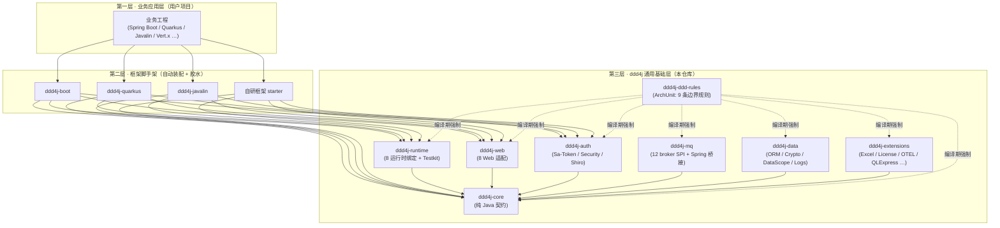
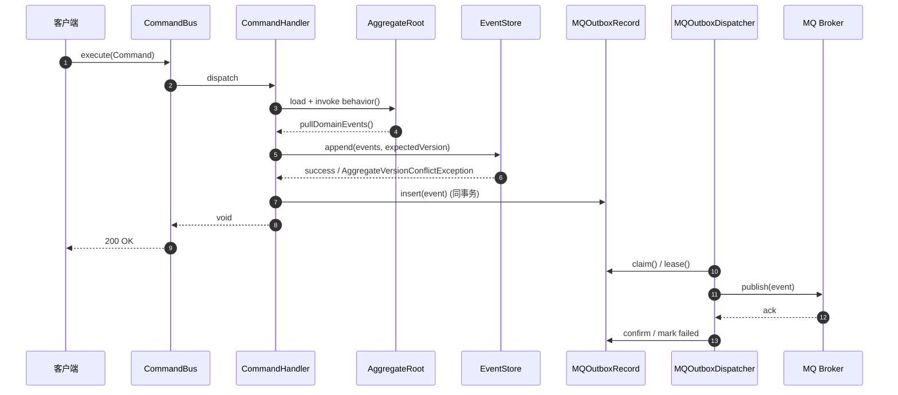
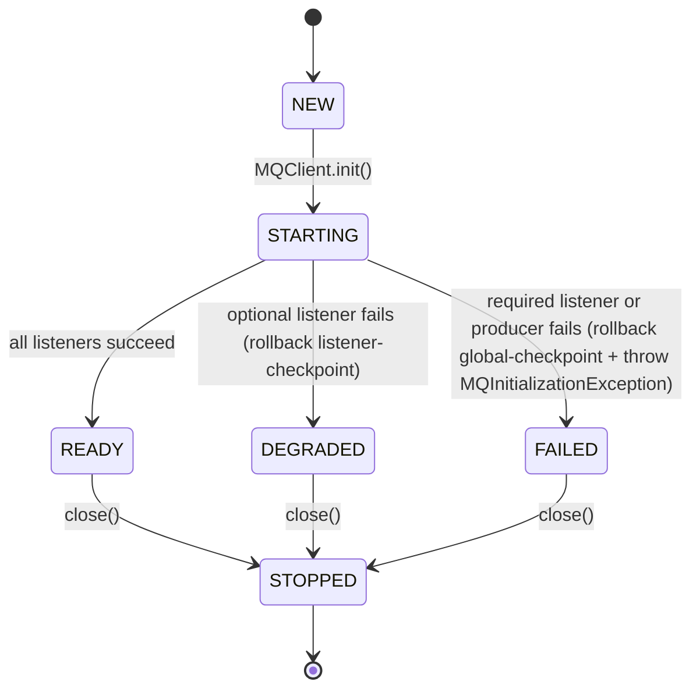
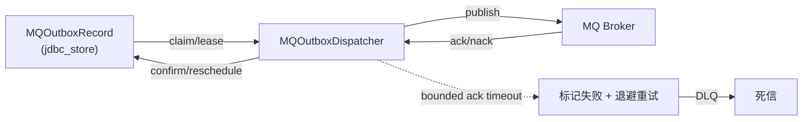
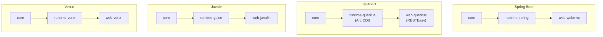
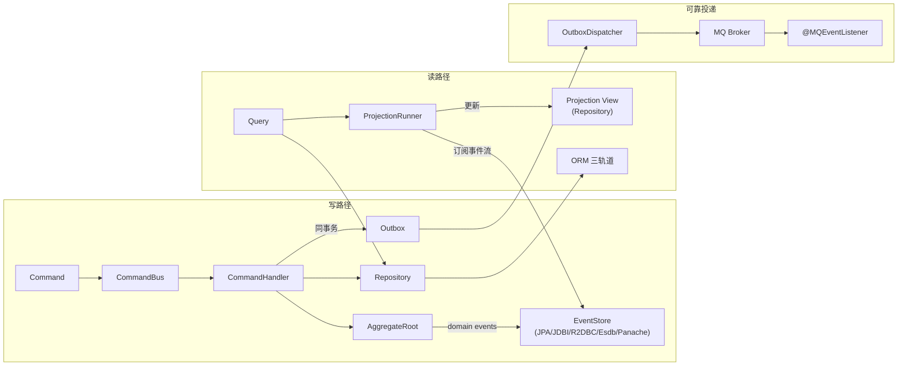
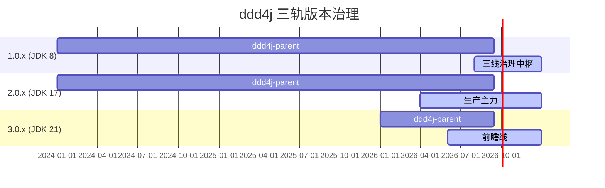

# 8、ddd4j-Architecture.zh_CN

> **文档说明**：ddd4j 系统架构设计。覆盖分层架构、运行时矩阵、依赖隔离、数据流（命令/事件/读模型/可靠投递）、跨框架适配、ArchUnit 边界守护、安全与可观测性、部署形态与故障处理。
>
> **版本**：V1.0.0
> **最后更新**：2026-09-24
> **对齐代码 HEAD**：`41f690b7`（1.0.x）/ `60984788`（2.0.x）/ `1471e2ca`（3.0.x）
>
> **在决策链中的位置**：**Architecture** = Domain（做什么）→ Tech Plan（怎么做）→ Product Plan（什么时候做、谁来做）→ **Architecture**（在哪里做）。
> - 上游：[`7、ddd4j-领域模型设计.md`](./7、ddd4j-领域模型设计.md) — 抽象与契约
> - 上游：[`5、ddd4j-技术方案与路线.md`](./5、ddd4j-技术方案与路线.md) — 如何实现
> - 上游：[`6、ddd4j-产品与版本规划.md`](./6、ddd4j-产品与版本规划.md) — 何时做、谁来做
> - 上游：[`1.0.x/8、ddd4j-1.0.x-Architecture.zh_CN.md`](./1.0.x/8、ddd4j-1.0.x-Architecture.zh_CN.md) — 1.0.x 版本架构

---

## 1. 总览

ddd4j 是**框架无关的 DDD / CQRS / ES 通用基础层**。在客户端/服务端三层栈中位于"业务工程 ↔ 框架运行时"之下，承担两件事：

1. **领域契约**——以纯 Java SPI 形式定义 `AggregateRoot`、`DomainEvent`、`Repository`、`CommandBus`、`EventStore`、`ProjectionRunner`、`MQClient` 等核心抽象。
2. **基础设施适配**——以**可选/按需**方式提供 Spring / Quarkus / Javalin / Micronaut / Vert.x / Helidon / Dropwizard / Guice 8 种运行时绑定、3 种 ORM 轨道、12 种 MQ 适配。

它的架构价值不在于"提供更多适配器"，而在于"业务代码只写一次，便能在 8 种运行时之间自由迁移"。

> **架构师关键词**：内圈稳定（core SPI 字面级一致） + 外圈可换（适配层自由替换） + ArchUnit 守边界。

## 2. 模块拓扑

### 2.1 顶层 16 模块

| 层 | 模块 | 角色 | 关键产物 |
|:---|:---|:---|:---|
| 协调 / 元数据 | `ddd4j-parent` | Maven 父 POM | 编译 / 打包 / 发布规则 |
| | `ddd4j-bom` | 版本协调 | 外部项目统一引用 |
| | `ddd4j-dependencies` | 第三方依赖集中管理 | Spring 6.x · Jackson 2.22 · Reactor |
| 契约 / 注解 | `ddd4j-annotation` | DDD / API 注解 | `@DomainEntity` `@DomainService` `@DomainRepository` |
| | `ddd4j-core` | **纯 Java 契约层** | `AggregateRoot` · `Repository<M,P,ID>` · `Query<T>` · `Page` · `DomainEvent` · `EventStore` · `ProjectionRunner` · `MQClient` |
| | `ddd4j-kit` | 工具箱 | Hutool 风格增强 |
| | `ddd4j-ddd-rules` | ArchUnit 规则 | `CleanDDDLayerRules` · `ColaDDDLayerRules` |
| 数据 | `ddd4j-data` | ORM 三轨道 + 数据治理 | `mybatisplus` / `mybatis` / `jpa` + `crypto` / `datascope` / `external` / `logs` |
| 消息 | `ddd4j-mq` | 消息队列抽象 | `core` SPI + `spring` 桥接 + 12 broker |
| Web | `ddd4j-web` | Web 框架抽象 | `core` + 8 适配器 |
| 鉴权 | `ddd4j-auth` | 鉴权抽象 | `Subject` SPI + Sa-Token / Security / Shiro |
| 缓存 | `ddd4j-cache` | 缓存抽象 | 本地 / Redis / Memcached |
| 运行时 | `ddd4j-runtime` | 8 运行时绑定 | Spring / Quarkus / Guice / Micronaut / Vert.x / Helidon / Dropwizard / Testkit |
| 扩展 | `ddd4j-extensions` | 跨领域扩展 | akka / excel / jackson / license / monitor / pf4j / qlexpress / qrcode / validation / otel |
| 验证 | `ddd4j-samples` | 示例工程 | 共享 Order 业务内核 + 9 运行时样本 |

### 2.2 数据子模块矩阵

| 子模块族 | 模块 | 角色 |
|:---|:---|:---|
| ORM 轨道 | `ddd4j-data-mybatisplus` · `ddd4j-data-mybatis` · `ddd4j-data-jpa` | 三种持久化引擎 |
| 治理 | `ddd4j-data-crypto` · `ddd4j-data-datascope` · `ddd4j-data-logs` · `ddd4j-data-external` | 加解密 / 行级权限 / 操作日志 / 外部服务 |
| CQRS 适配 | `ddd4j-data-cqrs-{spring,guice,quarkus,vertx,javalin,micronaut,helidon,dropwizard}` | `CommandBus` 在 8 种运行时下的实现 |
| EventStore | `ddd4j-data-event-store-{esdb,jdbi,jpa,panache,r2dbc}` | 5 种事件存储后端 |
| Projection 调度 | `ddd4j-data-projection-{spring,guice,quarkus,vertx,javalin,micronaut,helidon,dropwizard,jpa,jdbi,r2dbc,panache}` | 12 种 projection 调度器 |
| 共享 | `ddd4j-data-projection` | projection 通用抽象 |

### 2.3 MQ 适配矩阵

| 适配器 | 关键类 | 关键能力 |
|:---|:---|:---|
| `ddd4j-mq-core` | `MQClient` · `MQListener` · `MqDomainEventPublisher` · `MQOutboxRecord` · `MQClientLifecycle`（v2026-09 新增） | 纯 Java SPI、outbox 持久化、LIFO 资源生命周期、启动状态机 |
| `ddd4j-mq-spring` | `MQListenerBeanPostProcessor` · `MQListenerRegistrar` | Spring Messaging 桥接、`DisposableBean.destroy()` 幂等、RuntimeReadinessRegistry 注册 |
| 11 个 broker 实现 | Kafka / RabbitMQ / RocketMQ / Redis Stream / NATS / Pulsar / ActiveMQ / MQTT / Mica MQTT / ONS / SQS / TDMQ / Disruptor | 各 broker 全部实现 fail-closed + bounded ack + 自建资源登记 |

## 3. 运行时主链路（Command → Outbox → MQ）

### 3.1 状态机（MQ 客户端启动生命周期，2026-09 新增）

### 3.2 Outbox 投递（fail-closed + bounded ack + bounded pool）

> Outbox 投递关键约束（v41f690b7 后的真实实现）：
> 1. publish 阻塞**有界**（`MQDeliveryPolicy`）→ 防止线程被 broker 卡死拖垮上游事务。
> 2. RabbitMQ 用 **bounded channel pool** 替换早期 ThreadLocal → 避免连接耗尽。
> 3. Kafka 防止 batch 重复消费 + listener leak → 由 3344af38 / 41f690b7 双 commit 修复。
> 4. 失败传播：必选 listener 失败抛 `MQInitializationException`（含 broker/topic/group/method 上下文 + suppressed rollback）。

## 4. 跨框架运行时绑定

> **运行时映射表**：见 [README §多框架运行时绑定](./README.md#5-maven-模块矩阵)。

## 5. ArchUnit 边界守护（编译期）

| 规则 | 约束 | 违反示例 |
|:---|:---|:---|
| `no_autoconfiguration_in_ddd4j` | 任何模块不得含 `@AutoConfiguration` | 把 `@AutoConfiguration` 引入 `ddd4j-core` 即被 ArchUnit 拒收 |
| `no_spring_in_core_modules` | core / kit / annotation 不得依赖 `org.springframework.*` | 在 core 里 `import org.springframework.beans.*` 即报错 |
| `no_spring_messaging_in_mq_core` | mq-core 不得依赖 `org.springframework.messaging.*` | mq-core 必须是 broker 无关的纯 Java SPI |
| `no_spring_factories_in_core` | core 不得引用 `AutoConfiguration.imports` | 任何"自动发现"机制都不允许进入契约层 |
| `no_hutool_all_in_core` | core 不得依赖 hutool 全量包 | 强制 core 保持"零重量级依赖" |
| `core_no_mybatis` | core 不得依赖 `com.baomidou.*` | 业务模型不能绑 ORM API |
| `core_no_servlet` | core 不得依赖 `jakarta.servlet.*` | 业务模型不绑 Web 容器 |
| `core_no_validator` | core 不得依赖 `org.hibernate.validator.*` | 校验应在适配层 |
| `core_no_aspectj` | core 不得依赖 `org.aspectj.*` | AOP 切面在适配层 |

> 这些规则**默认通过 Maven Surefire 在 test-compile 阶段执行**；任何一次提交若违反，铁定挂掉 CI。

## 6. 数据流（写路径 / 读路径）

> **写路径与读路径解耦**：写路径只关心业务规则 + 事务一致性；读路径只关心查询性能。ProjectionRunner 通过 event chunk 异步追平两者之间的时延（最终一致）。

## 7. 三轨版本策略与差异化契约

> 三轨通过**核心 SPI 字面级一致**实现互替性。版本矩阵、升级路径、支持窗口、技术兼容性矩阵见 [`6、ddd4j-产品与版本规划.md`](./6、ddd4j-产品与版本规划.md)。三线允许差异的完整清单见 [`1.0.x/8、ddd4j-1.0.x-Architecture.zh_CN.md`](./1.0.x/8、ddd4j-1.0.x-Architecture.zh_CN.md)。

## 8. 安全设计

| 层 | 控制 |
|:---|:---|
| 契约层 | 不暴露任何注解驱动的安全能力（`@PreAuthorize` 等只能在 `ddd4j-auth-*` 中引用） |
| 数据层 | 行级权限：`RequiresDataPermissions` 注解 + `DataScopeProvider`（由 `ddd4j-data-datascope` 提供） |
| 字段级 | `@EncryptField`（`ddd4j-data-crypto`）支持 AES / SM4 / 国密 + `JpaEncryptFieldListener` 监听 |
| 鉴权 | `Subject` SPI（`ddd4j-auth-spring` 桥接）+ Sa-Token / Security / Shiro 三选一 |
| MQ 投递 | `MQEvent` 携带 `tenantId`；`partitionKey` 默认 `tag+tenant` 同 key 同顺序 |

## 9. 可观测性

- **指标**：`ddd4j-metrics` + `ddd4j-extension-otel` 提供 `OpenTelemetryProjectionMetrics` / `MqDeliveryMetrics`（outbox + inbox 双口径）。
- **健康检查**：每个 runtime 提供 `ReadinessContributor`（`ddd4j-runtime-{spring,quarkus,...}` 实现 `HealthIndicator`）。
- **审计**：MQ 启动状态机（`MQStartupStatus.snapshot()`）→ Spring `RuntimeReadinessRegistry` → `/actuator/health`。
- **追踪**：`ddd4j-extension-otel` 已覆盖 `EventSpanTest`、`DataScopeSpanTest`、`OtelMQDeliveryObserverTest`。

## 10. 部署形态

| 形态 | 适用 |
|:---|:---|
| **单体 jar** | 业务工程 + 单 runtime（最常见 Spring Boot / Quarkus 部署） |
| **微服务** | 每个限界上下文一个 runtime；共享 `ddd4j-bom`；MQ / DB 各自独立 |
| **多 runtime 混合** | 主服务 Spring Boot + 旁路 Javalin 适配遗留系统（共享 `ddd4j-core`） |
| **Maven 多模块** | 业务工程按 COLA V5 拆分 `adapter / app / domain / infrastructure` 四层 |

> **部署不绑定**：因为 `ddd4j-core` 零容器依赖，`ddd4j-runtime` 提供 8 种 binding，业务工程可随团队偏好自由切换，无需修改领域层。

## 11. 故障处理

| 故障 | 行为 | 恢复路径 |
|:---|:---|:---|
| Producer init 失败 | `MQInitializationException` + 全局 rollback | 应用启动失败；运维介入 |
| 必选 listener init 失败 | 同上 + rollback checkpoint + 撤销 publisher | 应用启动失败 |
| 可选 listener init 失败 | 进入 `DEGRADED`；`ReadinessContributor` 返回 false | K8s 滚动期间流量摘除 |
| Outbox 投递失败 | bounded ack timeout → 标记失败 + 退避重试 | 配置 MQ delivery policy 调整超时 |
| Kafka batch 重复 | 由 `KafkaMQClientDurabilityContractTest` 守护；运行期由 `MQOutboxRecord` 版本字段去重 | 清理 outbox 中半完成记录 |
| 进程崩溃 | LIFO 关闭（`MQClientLifecycle.close()`）幂等执行；剩余资源被 `MQOutboxDispatcher` 重扫 | 自动恢复 |

## 12. 演进方向

1. **三线对齐持续治理**：每两周一次 CodeGraph 严格门禁，公共 API 差异必须按"必要兼容差异"语义归类。
2. **MQ 启动生命周期收尾**（见 `5、ddd4j-技术方案与路线.md`）：Spring 启动传播、11 broker 适配器覆盖、Task 7 三线同步、Task 8 verify。
3. **License Gate Hardening 阶段 1**：把 1.0.x、3.0.x 的 SBOM/license 门禁跑绿，否则不进入 MQ 二阶段。
4. **domain-event 跨 runtime 观测**：从 `ddd4j-extension-otel` 扩到 8 种 runtime。
5. **Helidon 4 / Dropwizard 5 / Quarkus 3.5+ 适配**：1.0.x 受字节码约束暂未跟进，2.0/3.0 视社区需求再评估。

---

**文档版本**：V1.0.0
**最后更新**：2026-09-18
**文档状态**：✅ 待评审