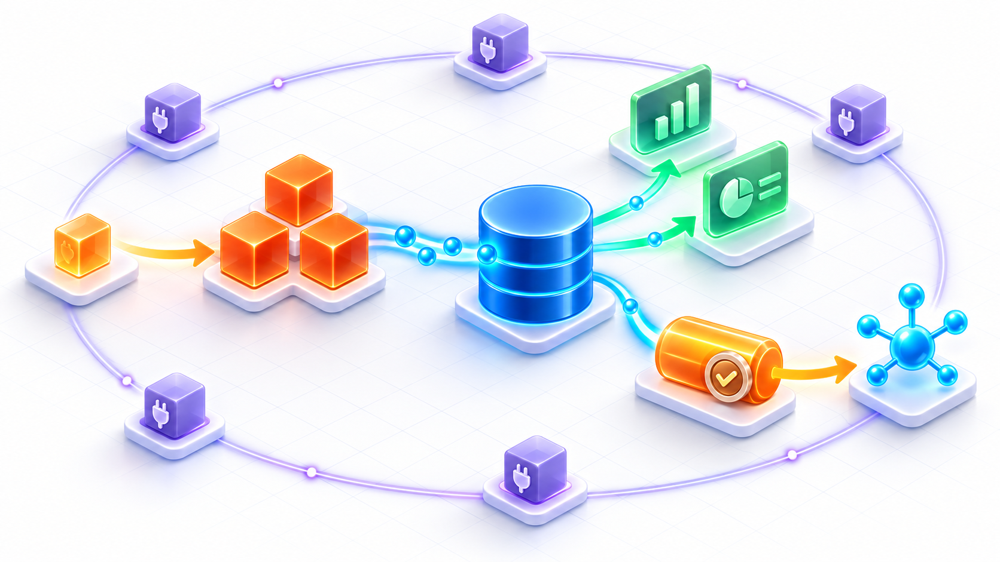

# Ddd4j — Framework-Agnostic DDD, CQRS and Event Sourcing Foundation

<p align="center">
  
</p>

<p align="center">
  <strong>Connect domain models, commands, events, projections, and reliable delivery through framework-agnostic Java contracts.</strong><br>
  A reusable foundation for DDD, CQRS, Event Sourcing, multi-runtime integration, and production-oriented messaging.
</p>

<p align="center">
  
</p>

<p align="center">
  <a href="README.md">简体中文</a> ·
  <a href="ddd4j-samples/README.md">Samples</a> ·
  <a href="8、ddd4j-Architecture.zh_CN.md">System Architecture</a> ·
  <a href="5、ddd4j-技术方案与路线.md">Technical Plan</a> ·
  <a href="docs/superpowers/plans/2026-09-10-mq-startup-lifecycle.md">MQ Startup Lifecycle</a>
</p>

> **Ddd4j** is a framework-agnostic Java foundation for Domain-Driven Design, CQRS, and Event Sourcing. It keeps the domain contracts independent from a concrete container and can be integrated by Spring Boot, Quarkus, Javalin, Micronaut, Vert.x, Helidon, Dropwizard, and Guice runtimes.
>
> The DDD, CQRS, and Event Sourcing abstractions are all implemented in-house inside `ddd4j-core`, following the canonical Eric Evans and Vaughn Vernon theory. API shape is inspired by [ddd-4-java](https://github.com/fuinorg/ddd-4-java) and [cqrs-4-java](https://github.com/fuinorg/cqrs-4-java) (reference only — not a runtime dependency).

---

## 1. Positioning

| Dimension | Description |
|:---|:---|
| **Purpose** | Framework-agnostic DDD / CQRS / ES foundation (not a Spring Boot application) |
| **JDK support** | Java 8 (1.0.x) · Java 17 (2.0.x) · Java 21 (3.0.x) — three active lines |
| **Consumers** | `ddd4j-boot` (Spring Boot) · `ddd4j-quarkus` · `ddd4j-javalin` · first-party Vert.x / Helidon / Micronaut / Dropwizard / Guice business applications |
| **Foundation** | Zero third-party DDD frameworks; the DDD / CQRS / ES abstractions are all implemented in `ddd4j-core` |
| **Iron rule** | Core / annotation / mq-core base contract layer has **zero** `@AutoConfiguration`, **zero** `spring.factories`, **zero** `starter`; framework adapters use only explicit `@Configuration` / `@Component` glue |

## 2. At a glance

<p align="center">
  
</p>

> **Core runtime path:** `Command → Aggregate → Event Store → Projection / Query View`. Domain events enter the transactional Outbox in the same transaction as the business write, then a dispatcher publishes them safely to the selected message broker.

### 2.1 Three-layer architecture

```
┌─────────────────────────────────────────────────────────────────────┐
│ Layer 1 · Business application (consumer project)                     │
│   User's Spring Boot / Quarkus / Javalin / Micronaut / Vert.x app     │
└──────────────────────────┬──────────────────────────────────────────┘
                           │  depends on a framework starter
                           ▼
┌─────────────────────────────────────────────────────────────────────┐
│ Layer 2 · Framework starter (auto-config + glue)                       │
│   ddd4j-boot / ddd4j-quarkus / ddd4j-javalin / first-party Vert.x    │
│   contains: @AutoConfiguration · starter · Bean wiring · filter · …  │
└──────────────────────────┬──────────────────────────────────────────┘
                           │  depends on base contract layer
                           ▼
┌─────────────────────────────────────────────────────────────────────┐
│ Layer 3 · ddd4j base contract layer (this repository)                  │
│   Pure-Java contracts · SPI · abstract base types · DDD building     │
│   blocks · ArchUnit rules                                          │
└──────────────────────────┬──────────────────────────────────────────┘
           ┌───────────────┼───────────────┐
           ▼               ▼               ▼
        DDD building    CQRS abstracts    ES abstracts
       (ddd4j-core)    (ddd4j-core)    (ddd4j-core)
```

## 3. Three-line release strategy

ddd4j evolves along **three active lines** in parallel; HEADs always push the same MQ hardening commit together:

| Line | JDK | Maven | Jackson | JPA namespace | Current HEAD | Role |
|:---|:---:|:---:|:---:|:---:|:---|:---|
| **feature/1.0.x** | **8** | **3.9.16** | Jackson 2 | `javax.persistence` | `41f690b7` (2026-09-15) | Production + three-line governance hub |
| **feature/2.0.x** | **17** | **3.9.16** | Jackson 2 | `jakarta.persistence` (in migration) | `e3ceb44e` (2026-09-15) | Production mainline |
| **feature/3.0.x** | **21** | **4.0.0-rc-6** | **Jackson 3 / tools.jackson** | fully jakarta | `d21e90a4` (2026-09-15) | Forward-looking line (JDK 21 + Maven 4) |

> **Three-line alignment contract.** The strict audit of 2026-09-09 found **zero** structural / class / public-API / CodeGraph-signature differences between **2.0.x and 3.0.x**. Between **1.0.x and 2.0.x** the audit found 19 public JVM API differences and 231 method-body differences that are rooted in JDK 8 bytecode constraints (no `java.net.http.HttpClient`, no Helidon 3.2 on JDK 8, etc.) — see [`docs/superpowers/reports/2026-09-09-three-line-source-parity-audit.md`](docs/superpowers/reports/2026-09-09-three-line-source-parity-audit.md).

## 4. Maven modules

| Module | Role | Key artifacts |
|:---|:---|:---|
| `ddd4j-bom` | BOM version manager | unified version for downstream projects |
| `ddd4j-dependencies` | third-party dependency coordinator | Spring 6.x · Jackson 2.22 · Reactor |
| `ddd4j-annotation` | DDD annotations + API annotations | `@DomainEntity` `@DomainService` `@ApplicationService` `@DomainRepository` |
| `ddd4j-core` | **pure-Java contract layer** | `AggregateRoot` · `Repository<M,P,ID>` · `Query<T>` (lambda-rich query) · `Page` · `R` · `DomainEvent` · `DddAggregateRoot` · `SFunction` · `LambdaKit` |
| `ddd4j-kit` | toolbox | Hutool-style utilities for cache / lang / web |
| `ddd4j-ddd-rules` | DDD architecture rules | `CleanDDDLayerRules` · `ColaDDDLayerRules` (ArchUnit) |
| `ddd4j-data` | data abstractions | three ORM tracks + crypto / data-permission / external-service / logging |
| `ddd4j-mq` | message-queue abstractions | `MQBrokerAdapter` SPI + Spring bridge + 12 broker implementations |
| `ddd4j-web` | web abstractions | WebMVC / WebFlux / Javalin / Quarkus / Vert.x / Micronaut / Helidon / Dropwizard |
| `ddd4j-auth` | auth abstractions | `Subject` SPI + Sa-Token / Security / Shiro |
| `ddd4j-cache` | cache abstractions | cache SPI and implementations |
| `ddd4j-runtime` | multi-framework runtime binders | Spring / Quarkus / Guice / Micronaut / Vert.x / Helidon / Dropwizard / Testkit |
| `ddd4j-extensions` | cross-domain extensions | akka / excel / jackson / license / monitor / pf4j / qlexpress / qrcode / validation / otel |
| `ddd4j-parent` | Maven parent POM | build / package / release rules |
| `ddd4j-samples` | sample applications | shared Order business kernel + 9 runtime samples |

## 5. Multi-runtime binding

| Framework | Runtime binder | DI container | Event publishing | Web framework |
|:---|:---|:---|:---|:---|
| Spring Boot | `ddd4j-runtime-spring` | `ApplicationContext` | `AppCtx.publishEvent()` | Spring MVC / WebFlux |
| Quarkus | `ddd4j-runtime-quarkus` | Arc (CDI) | `Event<T>.fire()` | RESTEasy / JAX-RS |
| Javalin | `ddd4j-runtime-guice` | Guice Injector | `EventBus.post()` | Javalin |
| Micronaut | `ddd4j-runtime-micronaut` | Micronaut Context | `publishEvent()` | Micronaut HTTP |
| Vert.x | `ddd4j-runtime-vertx` | explicit Runtime | Vert.x EventBus | Vert.x Web |
| Helidon | `ddd4j-runtime-helidon` | CDI / BeanManager | CDI Event | Helidon WebServer |
| Dropwizard | `ddd4j-runtime-dropwizard` | explicit Bundle | Listener collection | Jersey |

## 6. ArchUnit boundary enforcement

9 ArchUnit rules enforced at CI compile time:

| Rule | Description |
|:---|:---|
| `no_autoconfiguration_in_ddd4j` | no module may contain `@AutoConfiguration` |
| `no_spring_in_core_modules` | core / kit / annotation must not depend on `org.springframework.*` |
| `no_spring_messaging_in_mq_core` | mq-core must not depend on `org.springframework.messaging.*` |
| `no_spring_factories_in_core` | core must not reference `AutoConfiguration.imports` |
| `no_hutool_all_in_core` | core must not depend on the all-in-one Hutool jar |
| `core_no_mybatis` | core must not depend on `com.baomidou.*` |
| `core_no_servlet` | core must not depend on `jakarta.servlet.*` |
| `core_no_validator` | core must not depend on `org.hibernate.validator.*` |
| `core_no_aspectj` | core must not depend on `org.aspectj.*` |

## 7. Usage

### 7.1 Import via BOM (recommended)

```xml
<dependencyManagement>
    <dependencies>
        <dependency>
            <groupId>io.ddd4j</groupId>
            <artifactId>ddd4j-bom</artifactId>
            <version>${ddd4j.version}</version>
            <type>pom</type>
            <scope>import</scope>
        </dependency>
    </dependencies>
</dependencyManagement>
```

```xml
<dependencies>
    <!-- core contracts (required) -->
    <dependency>
        <groupId>io.ddd4j</groupId>
        <artifactId>ddd4j-core</artifactId>
    </dependency>
    <!-- data tier (optional) -->
    <dependency>
        <groupId>io.ddd4j</groupId>
        <artifactId>ddd4j-data-mybatis</artifactId>
    </dependency>
    <!-- web tier (optional) -->
    <dependency>
        <groupId>io.ddd4j</groupId>
        <artifactId>ddd4j-web-webmvc</artifactId>
    </dependency>
    <!-- runtime binder (optional) -->
    <dependency>
        <groupId>io.ddd4j</groupId>
        <artifactId>ddd4j-runtime-spring</artifactId>
    </dependency>
</dependencies>
```

### 7.2 Anemic vs. rich-model separation

The plain DDD path **does not require** domain models to extend `com.baomidou.mybatisplus.Model`, nor any fixed prefix / parent class. Domain layer only depends on `ddd4j-core`; the infrastructure layer adapts MyBatis-Plus via `ddd4j-data-mybatis`.

```java
public class Order extends AggregateRoot<Long> {
    private final Long id;
    private String buyerName;

    public Order(Long id, String buyerName) {
        this.id = id;
        renameBuyer(buyerName);
    }

    @Override
    public Long id() { return id; }

    public void renameBuyer(String buyerName) {
        if (StrKit.isBlank(buyerName)) {
            throw new IllegalArgumentException("buyerName must not be blank");
        }
        this.buyerName = buyerName;
    }

    public String buyerName() { return buyerName; }
}
```

```java
public interface OrderRepository extends Repository<Order, OrderPO, Long> {
    Optional<Order> findByOrderNo(String orderNo);
}
```

```java
public class MybatisOrderRepository extends MybatisAggregateRepository<Order, OrderPO, Long>
        implements OrderRepository {

    public MybatisOrderRepository(BaseMapper<OrderPO> mapper) { super(mapper); }

    @Override
    public Optional<Order> findByOrderNo(String orderNo) {
        return Optional.ofNullable(lambdaQuery()
                .eq(OrderPO::getOrderNo, orderNo)
                .one())
                .map(this::toModel);
    }

    @Override public Order toModel(OrderPO po) { return new Order(po.getId(), po.getBuyerName()); }
    @Override public OrderPO toPersistenceObject(Order model) {
        OrderPO po = new OrderPO();
        po.setId(model.id()); po.setBuyerName(model.buyerName());
        return po;
    }
}
```

### 7.3 Lambda-rich queries

```java
Page<Order> page = new OrderQuery()
    .eq(Order::getStatus, "PAID")
    .like(Order::getOrderNo, "2024")
    .ge(Order::getCreateTime, startTime)
    .page();

Page<OrderPO> po = new OrderQuery()
    .withPO(OrderPO.class)
    .eq(OrderPO::getStatus, "PAID")
    .orderByDesc(OrderPO::getCreateTime)
    .current(1).size(20)
    .page();
```

`Repository<M, P, ID>` aligns with `BaseMapper`:

```
Repository<M, P, ID>
├── single CRUD:    findById / save / updateById / insertOrUpdate / delete / deleteById
├── batch ops:      findByIds / deleteByIds / saveBatch / updateBatchById / insertOrUpdateBatch
├── unconditioned:  findFirst / findAll / count / exists
├── conditional:     findFirst(Query<M>) / findList / page / count / maps / exists
├── conditional ops: update(M, Query<M>) / deleteByQuery(Query<M>)
└── aggregation:    fill(Query<M>, M) / fill(Query<M>, List<M>)
```

## 8. Recommended project layout (COLA V5)

```
order-service/
├─ src/main/java/com/example/order/
│  ├─ adapter/        # inbound: Web / MQ / RPC
│  ├─ client/         # outbound API + DTOs
│  ├─ app/            # use-case orchestration, transaction boundaries
│  ├─ domain/         # core domain (zero external deps)
│  └─ infrastructure/ # technical adapters
└─ pom.xml
```

Dependency direction: `adapter → app → domain ← infrastructure`.

## 9. Documentation

| Document | Description |
|:---|:---|
| [8、ddd4j-Architecture.zh_CN.md](./8、ddd4j-Architecture.zh_CN.md) | System architecture (layers, runtime, deps, security, deployment) |
| [5、ddd4j-技术方案与路线.md](./5、ddd4j-技术方案与路线.md) | Current technical plan: MQ startup lifecycle + License Gate Hardening + three-line alignment |
| [7、ddd4j-领域模型设计.md](./7、ddd4j-领域模型设计.md) | Bounded contexts, aggregates, event contracts |
| [1.0.x/8、ddd4j-1.0.x-Architecture.zh_CN.md](./1.0.x/8、ddd4j-1.0.x-Architecture.zh_CN.md) | 1.0.x version-level architecture with three-line diff table |
| [docs/superpowers/specs/2026-07-15-current-source-architecture-design.md](./docs/superpowers/specs/2026-07-15-current-source-architecture-design.md) | Current source-code architecture tour (CodeGraph) |
| [docs/superpowers/specs/2026-06-29-ddd4j-boundary-rules-design.md](./docs/superpowers/specs/2026-06-29-ddd4j-boundary-rules-design.md) | Architecture boundary rules |
| [docs/superpowers/reports/2026-09-09-three-line-source-parity-audit.md](./docs/superpowers/reports/2026-09-09-three-line-source-parity-audit.md) | Three-line strict-parity audit report |

---

**Document version**: V1.0.0
**Last updated**: 2026-09-18
**Document status**: ✅ Pending review
**Aligned to**: HEAD `41f690b7`