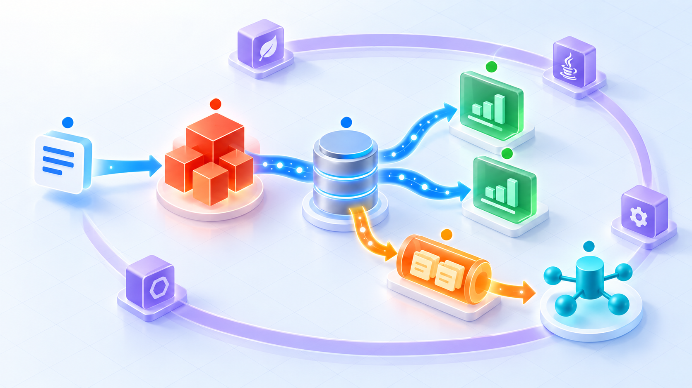

# Ddd4j — Framework-Agnostic DDD, CQRS and Event Sourcing Foundation

  

  <strong>Connect domain models, commands, events, projections, and reliable delivery through framework-agnostic Java contracts.</strong> 
  A reusable foundation for DDD, CQRS, Event Sourcing, multi-runtime integration, and production-oriented messaging.

  <a href="README.md">简体中文</a> ·
  <a href="ddd4j-samples/README.md">Samples</a> ·
  <a href="docs/superpowers/specs/2026-07-15-current-source-architecture-design.md">Source architecture</a>

**Ddd4j** is a framework-agnostic Java foundation for Domain-Driven Design, CQRS, and Event Sourcing. It keeps the domain contracts independent from a concrete container and can be integrated by Spring Boot, Quarkus, Javalin, Micronaut, Vert.x, Helidon, Dropwizard, and Guice runtimes.

## Positioning

| Dimension | Description |
| --- | --- |
| Purpose | Framework-agnostic DDD/CQRS/ES foundation, not a Spring Boot application |
| Core | Pure Java contracts, SPI interfaces, abstract base types, DDD building blocks, and ArchUnit rules |
| Runtime integrations | Spring Boot, Quarkus, Javalin, Micronaut, Vert.x, Helidon, Dropwizard, and Guice |
| Delivery | In-process domain events, cross-process messaging, and a production-oriented Outbox path |

## At a glance

  

> **Core runtime path:** Command → Aggregate → Event Store → Projection / Query View. Domain events enter the transactional Outbox with the business write, then a dispatcher publishes them safely to the selected message broker.

## Architecture

- **Domain model** — `AggregateRoot`, `Entity`, `ValueObject`, `DomainEvent`, and `Repository` form the framework-neutral tactical DDD vocabulary.
- **Write side** — `CommandBus` routes commands to executors; aggregates apply business rules and append version-checked events through `EventStore`.
- **Read side** — `ProjectionRunner` consumes event chunks incrementally and maintains query-oriented views.
- **Reliable delivery** — `MQOutboxStore` and `MQOutboxDispatcher` support transactional enqueueing, claim/lease, retry, backoff, dead-letter handling, and broker publication.
- **Adapters** — framework runtimes own discovery, dependency injection, scheduling, HTTP endpoints, and readiness exposure; they do not own domain rules.

## Further reading

The authoritative detailed documentation, module catalog, examples, architecture rules, and release guidance are currently maintained in the [Chinese README](README.md).
