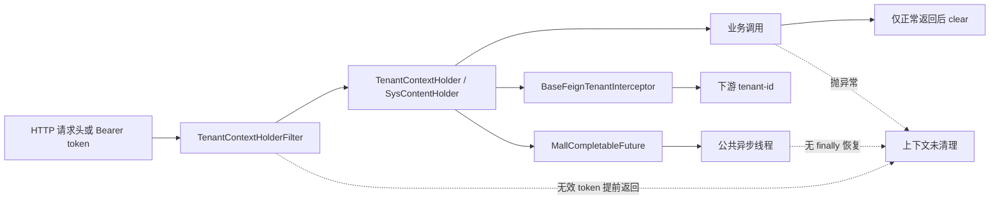

# Cloud 租户上下文与 Feign 传播契约审计

本审计只记录当前源码事实、兼容性判断与后续验收门禁，不修改 `ddd4j-cloud`、旧 `ddd4j` 或 `cloud-agents`。新版 `ddd4j` 的上下文对象能够承载租户信息，但尚不能据此认定已经兼容旧系统的身份可信度、异步传播与服务间转发语义。

## 结论

1. `ddd4j-cloud` 的 `TenantContextHolderFilter` 只在过滤链正常返回后清理上下文；过滤链抛异常、令牌无效提前返回时均可能把租户、系统或门店信息遗留在线程池工作线程中。
2. 未携带 Bearer 令牌时，过滤器直接信任 `tenant-id` 请求头；系统管理员的 `switch-tenant-id` 分支也没有执行源码中已注释掉的租户成员校验。它们是身份信任策略，不应被新版 `WebRequestContext.tenantId` 的字段搬运掩盖。
3. `MallCompletableFuture` 把租户、系统、SecurityContext 与 RequestAttributes 写入公共异步线程，但没有在 `finally` 中恢复或清理原状态。线程复用时存在跨任务污染风险；`TransmittableThreadLocal` 本身不能替代作用域关闭。
4. `BaseFeignTenantInterceptor` 会把当前 `TenantContextHolder` 的租户写入下游 `tenant-id`，因此上游污染会继续传播。该拦截器没有验证租户来源，验证责任必须在入口完成。
5. `AbstractServiceFeignRequestInterceptor.postProcessBeforeInitialization` 调用了 `ServiceFeignRequestInterceptor.super.postProcessAfterInitialization`，绕过接口默认的 `postProcessBeforeInitialization` 注册逻辑。服务级拦截器可能没有进入 `FeignInterceptorFactory`。
6. 新版 `ThreadContext.open()` 与 `WebContextScope` 已具备嵌套快照恢复能力；但 `WebRequestContext` 只保存传入的 `tenantId`，不负责认证，也没有自动覆盖旧 Cloud 的异步和 Feign 传播。迁移必须由框架入口建立可信身份，再使用闭合作用域。

## 当前调用链

### HTTP 入口

`TenantContextHolderFilter` 的已确认行为：

- 先把 `shop-id`、`system-id` 请求头写入上下文，再验证 Bearer token。
- token 在 Redis 中不存在时直接输出错误并返回；此前写入的 shop/system 没有清理。
- token 有效时从 token additional information 读取 tenant/system。
- 系统租户可通过 `switch-tenant-id` 改写目标租户；允许租户列表检查被注释，没有执行。
- 没有 Bearer token 时，直接把请求头 `tenant-id` 写入上下文。
- `filterChain.doFilter`、请求属性移除和 `TenantContextHolder.clear()` 没有置于 `try/finally`。

### 异步入口

`MallCompletableFuture.runAsyncWidthProperties` 的两个重载都会捕获或读取调用线程的上下文，再写入 `CompletableFuture.runAsync` 使用的线程。任务完成或抛异常后，没有恢复以下状态：

- `TenantContextHolder` 的 tenant/system；
- `SecurityContextHolder`；
- `RequestContextHolder`。

这不是“传播不完整”，而是传播生命周期不闭合。不能通过继续增加 ThreadLocal 字段修复，必须使用快照加闭合作用域。

### Feign 注册与转发

- `BaseFeignTenantInterceptor.apply` 在当前租户非空时写入 `tenant-id`。
- `ServiceFeignRequestInterceptor` 的默认 `postProcessBeforeInitialization` 才执行按服务名注册。
- `AbstractServiceFeignRequestInterceptor` 却从 before 方法调用 after 默认方法，因而没有调用上述注册实现。
- `FeignInterceptorFactory` 是进程级静态注册表，当前公开 API 只有 register/get，没有清理或按 Spring ApplicationContext 隔离的生命周期。

因此迁移时需要分别解决“是否注册”“转发什么身份”“容器关闭后是否残留”三项问题，不能把 Feign 头存在当作租户传播正确的证明。

## 与新版 ddd4j 的映射

| 旧契约 | 新版能力 | 兼容判断 |
|---|---|---|
| `TenantContextHolder.getTenantId()` | `ThreadContext.get(ContextConstants.TENANT_ID)` | 键可映射，生命周期和可信来源尚未等价 |
| 过滤器写入并在末尾 clear | `WebContextScope.open(WebRequestContext)` | 新版 close 可恢复旧快照；入口必须使用 try-with-resources 或等价 finally |
| TTL 自动跨线程 | `ThreadContext.open(resources)` | 能用显式快照建立任务作用域；当前未发现对任意执行器的自动安全包装承诺 |
| Feign 写 `tenant-id` | `WebRequestContext.tenantId` / `ThreadContext` | 需要独立的出站适配器；只应转发入口认证后的租户 |
| shop/system 独立 ThreadLocal | 通用 `ThreadContext` key/value | 可按稳定 key 保存，但必须保留清理、嵌套恢复和类型约束 |

新版 `ThreadContext.Scope.close()` 会恢复进入作用域前的资源快照；`WebContextScope.close()` 同时恢复 MDC。这解决的是状态生命周期，不解决请求头、令牌、内部凭据或租户切换是否可信。

## cloud-agents 实际影响

`cloud-agents` 当前使用的是旧 `com.dddframework.core.context.ThreadContext`，不是 `ddd4j-cloud` 的 `TenantContextHolder`：

- `BaseAppService` 从 ThreadContext 读取 tenant/user/shop/app。
- 多个控制器直接依赖 tenant/user；部分 AIGC 接口在 ThreadContext 缺失时回退到请求头或参数。
- `ImageGenSubmitMqConsumer` 仅在消息包含 tenant 时写入，最后删除 tenant key；若工作线程原先已有外层租户，删除会丢失外层值而不是恢复它。
- 多个应用服务已手工保存 previousTenantId 并在 finally 恢复，表明嵌套恢复是现行业务契约。

所以未来适配不能机械替换 import。应先提供一个作用域适配层，使旧调用点仍能读取相同 key，并把 HTTP、MQ、异步任务和内部调用统一为“进入时绑定、退出时恢复”。本审计没有迁移 `cloud-agents`。

## 必须通过的同输入门禁

| 场景 | 必须观察的结果 |
|---|---|
| 正常 HTTP 请求 | 业务内读取认证后的 tenant；返回后工作线程无新增状态 |
| 业务抛异常 | tenant/system/shop、SecurityContext、RequestAttributes、MDC 全部恢复 |
| 无效 Bearer token | 业务不执行，且预先写入的请求头状态不残留 |
| 无 Bearer 但有 tenant header | 明确选择拒绝或仅允许受信网关；三框架结果一致 |
| switch tenant | 必须验证目标租户在授权集合中；越权目标被拒绝 |
| 嵌套租户作用域 | 内层成功或异常退出后都恢复外层租户 |
| 公共线程池连续任务 | 第二个无租户任务看不到第一个任务的 tenant/security/request 状态 |
| MQ 消息缺 tenant | 不继承工作线程旧 tenant；按规格拒绝或显式无租户执行 |
| Feign 出站 | 仅转发已认证的当前租户；无租户时不携带旧头 |
| 多 Spring 容器启停 | 服务级拦截器不串容器、不重复注册、不保留已关闭容器实例 |

以上场景应在 Boot、Javalin、Quarkus 使用同一输入向量验证。测试需要复用同一工作线程并制造异常，单次请求成功、字段名一致或 ThreadLocal 单元测试都不足以证明隔离正确。

## 建议实施顺序

1. 先为新版上下文补充显式 capture/wrap 适配能力或在各异步入口使用 `ThreadContext.open(snapshot)`，测试先覆盖线程复用与异常恢复。
2. 各 Web 适配器只把认证层确认的 tenant 构造成 `WebRequestContext`；原始 header fallback 作为显式兼容策略，不作为默认可信身份。
3. MQ、调度器和手工切租户代码统一使用 AutoCloseable 作用域，禁止 set/remove 模拟恢复。
4. 修复服务级 Feign 注册生命周期，并取消进程级静态实例泄漏，或至少提供按容器注销门禁。
5. 最后运行三框架同输入 HTTP、异步、MQ、Feign 差分测试，再评估是否能替换旧上下文实现。

## 新版同步请求异常恢复修复（2026-09-08）

继续沿 CodeGraph 调用链检查 `WebContextScope` 的消费者后，发现作用域本身能够恢复快照，但两个调用方在幂等完成回调抛异常时无法保证执行 close：

- `SynchronousWebRequestSession.complete(true)` 原先先调用幂等 `complete`，随后才 close；前者抛异常会跳过请求作用域关闭。
- `Ddd4jWebMvcInterceptor.RequestState.close` 原先依次调用幂等 `complete`、幂等 close、上下文 close；任一前置步骤抛异常都可能跳过后续清理。

新增相同的三线回归，先把外层租户设为 `outer-tenant`，请求作用域绑定 `tenant-a` 或 `inner-tenant`，再让 `IdempotencyGuard.complete` 抛出异常。修复前两项测试均观察到内层租户仍留在当前线程；修复后三线统一使用嵌套 `try/finally`，保证幂等租约关闭和上下文快照恢复，不修改任何公开类、方法或参数。

聚焦验证结果：

- JDK 8 / 1.0：`SynchronousWebRequestSessionTest` 6 项、`Ddd4jWebMvcInterceptorTest` 2 项全部通过，零跳过。
- JDK 17 / 2.0：同样 6 项与 2 项全部通过，零跳过。
- JDK 21 / 3.0：使用 Maven 4.0.0-rc-6，同样 6 项与 2 项全部通过，零跳过。

这是异常清理的聚焦证明，不替代三线完整 Reactor、samples 或真实线程池/MQ/Feign 差分测试。Maven 4 仍输出大量 effective-model 警告，本次测试成功不表示这些构建模型警告已经消除。

## WebFlux 请求头传播差异修复（2026-09-08）

CodeGraph 显示 `Ddd4jWebFluxFilter.extractHeaders` 是 WebFlux 请求进入 `WebOtelSupport.startServerSpan` 的唯一请求头采集点，但此前没有覆盖该方法的过滤器入口测试。三线源码逐项对照确认：2.0/3.0 使用 `!v.isEmpty()`，1.0 错误地使用 `v.isEmpty()` 后再读取 `v.get(0)`。这类方法体差异不会被目录、类名、方法名和参数签名一致性门禁发现。

新增三线相同测试，以普通 `traceparent` 和双值 `X-Multi` 输入验证采集结果。1.0 修复前实际得到空 Map，断言 `traceparent` 为 null；随后只把反向条件改为与 2.0/3.0 相同的非空判断。JDK 8/17/21 三线 `Ddd4jWebFluxContractTest` 均为 3 项通过、零失败、零错误、零跳过。

该测试证明过滤器把正常请求头及首值交给 OTel 桥接层，不证明全局 OTel SDK、Exporter 或跨进程 Trace 已正确部署。2.0 测试仍报告 commons-logging 与 spring-jcl 共存警告，3.0 Maven 4 仍报告 effective-model 警告，均需在独立依赖治理任务继续收敛。

## WebFlux OTel 反射与 Scope 生命周期修复（2026-09-08）

真实 OTel SDK 测试进一步确认两层缺陷。第一层是 `WebOtelSupport` 按 `Object` 参数反射查找 `activate`、`recordError`、`endServerSpan`，而扩展实现的真实参数为 `io.opentelemetry.api.trace.Span`；`activate` 查找失败后同一 try 块中的后续方法也没有绑定，生产调用静默退化为 noop。三线已改为运行时加载 Span 类并按真实签名绑定，保持 web-core 无 OTel 编译依赖和全部公开方法不变。

第二层在反射恢复后由同一红测暴露：旧过滤器在 `filter()` 返回 Publisher 前就激活有效 span，调用线程观察到 OTel Context 泄漏；Scope 又延迟到 `doFinally` 所在线程关闭，不满足线程局部 Scope 的所有权边界。三线现统一为：订阅时创建 SERVER span；在调用 `chain.filter` 的同一线程激活并立即关闭 Scope；Publisher 终止时结束 span。这样下游 Reactor/OTel 插桩可在链组装边界捕获当前 span，同时不会跨线程持有 Scope。

WebFlux 模块仅增加无显式版本的 `opentelemetry-sdk` 测试依赖，版本继续由 `ddd4j-dependencies` 的 OTel BOM 管理。真实 SDK 回归验证：过滤器组装前后当前线程均无有效 span，`chain.filter` 边界能看到有效 SERVER span；JDK 8/17/21 三线 `Ddd4jWebFluxContractTest` 各 4 项通过、零失败、零错误、零跳过。

该结果证明反射桥接实际生效及 Scope 的同步所有权边界；异步业务操作中的自动上下文传播仍取决于 Reactor/OTel instrumentation，尚未扩大为跨 scheduler、跨进程或 Exporter 验收。

### 反射桥接完整契约补强

原 `WebOtelSupportTest` 只断言各方法“不抛异常”，`isAvailable` 甚至只验证返回值是 true 或 false，无法区分真实委托与 noop。替换为 SDK + `InMemorySpanExporter` 后，三线首先同时失败：`WebOtelSupport` 查找文档承诺的 `WebOtelIntegration.isAvailable()`，扩展类却没有该方法，所以桥接处于前五个局部赋值、可用性方法缺失的非原子状态。

三线 `WebOtelIntegration` 已补齐公开静态 `isAvailable()`，直接委托 `Ddd4jOtel.isAvailable()`，使实现与既有反射协议及文档一致。新的四项契约实际验证：有效 span 创建与当前 Scope、异常事件、HTTP 503 的 ERROR 状态和属性、span 导出、响应 `traceparent` 注入，以及 null 输入降级。JDK 8/17/21 三线均为 4 项通过、零失败、零错误、零跳过。

`ddd4j-web-core` 新增的 `opentelemetry-sdk`、`opentelemetry-sdk-testing` 均为 test scope 且不声明版本，继续由统一 OTel BOM 管理。此次新增了三线完全相同的 `WebOtelIntegration.isAvailable()` 公开方法，没有删除或修改既有公开方法和参数。

## Micronaut OTel Scope 所有权修复（2026-09-08）

CodeGraph 对其余框架的 `WebOtelSupport.activate` 调用者分型后，确认 Micronaut 3 与 Micronaut 4 两种过滤器都直接丢弃 `activate(span)` 返回的 Scope。真实 SDK 测试在线程池工作线程中调用过滤器：修复前 `chain.proceed` 能看到有效 span，但过滤器返回及 Publisher 结束后当前线程仍保留该 span，稳定证明线程复用污染。

三线现按各自 Micronaut 过滤器 API 保持相同行为：仅在调用 `chain.proceed(request)` 或 `continuation.proceed()` 的同步边界激活 Scope，并在同一线程的 finally 中关闭；异步响应完成时仍按状态结束 span。新增三线相同语义的单线程复用测试，验证链组装边界存在有效 span、过滤器返回后无泄漏、Publisher 结束后仍无泄漏。JDK 8/17/21 三线各 1 项通过、零失败、零错误、零跳过。

Micronaut 模块新增的 `opentelemetry-sdk` 仅用于测试、不声明版本。这里收敛的是 OTel Scope 所有权；1.0 使用 Micronaut 3 原始 ThreadLocal、2.0/3.0 使用 Micronaut 4 PropagatedContext 的请求上下文实现仍有结构和传播机制差异，尚不能宣称三线 Micronaut 上下文逻辑完全一致。

## Micronaut 3 异步租户传播补齐（2026-09-08）

新增三线相同 HTTP 输入：请求携带 `X-Tenant-Id=tenant-async`，控制器通过 `Mono.delay` 和 `publishOn(boundedElastic)` 切换 scheduler，再从业务实际使用的 `ThreadContext.TENANT_ID` 读取租户。首次运行时三线都因测试读取框架包装对象而返回 409；改为业务层真实读取后，2.0/3.0 通过，1.0 仍稳定返回 `Micronaut async tenant context is missing`，从而把差距限定为 Micronaut 3 的 ThreadContext 传播缺失。

1.0 现利用 Micronaut 3 官方 `ServerRequestContext` 与 `ReactiveInvocationInstrumenterFactory`：过滤器把请求上下文放入请求属性，Reactor 每次回调进入时打开 `WebContextScope` 并绑定 Subject，退出时恢复此前的 ThreadContext 与包装上下文。实现以内嵌、非公开工厂留在现有 Web 适配器中，没有新建模块、JAR 或公开 API；2.0/3.0 继续使用 Micronaut 4 `ThreadPropagatedContextElement`。

修复后 JDK 8/17/21 的 scheduler 切换用例均通过；随后三线完整 `Ddd4jMicronautWebContractTest` 各 7 项通过、零失败、零错误、零跳过。两代 Micronaut 的内部 API 和源码结构仍不同，但对请求租户在 Reactor scheduler 切换后的可观察行为已经一致。

## Javalin OTel Scope 与异常清理修复（2026-09-08）

CodeGraph 确认 `Ddd4jJavalinWeb.openContext` 激活 OTel span 后只保存 span，直接丢弃 Scope；after 和 exception 只结束 span、关闭 WebContextScope。真实 Javalin 服务器测试在业务 handler 中观察到有效 span，再在 ddd4j after 之后观察工作线程，修复前后者仍为有效 span，证明请求 Scope 遗留。

三线现把 OTel Scope 纳入同一个 RequestState，并使关闭操作幂等。正常响应、异常、认证失败和上下文创建失败都会按嵌套 finally 依次关闭幂等租约、WebContextScope 与 OTel Scope；即使幂等 complete/close 抛异常，也不跳过后两项恢复。Javalin 6 与 Javalin 7 的测试注册 API 不同，但输入和观察结果一致。

真实服务器 Scope 测试在 JDK 8/17/21 三线各 1 项通过；随后三线完整 `Ddd4jJavalinWebContractTest` 各 6 项通过、零失败、零错误、零跳过。新增 `opentelemetry-sdk` 仅为 test scope、无模块内版本号。

后续按日志治理规则为三线 Javalin 增加无版本、test scope 的 `slf4j-simple`，没有引入 Logback。1.0 的 `ddd4j-dependencies` 原先只管理 slf4j-api，本轮在集中 dependencyManagement 补齐同一 `${slf4j.version}` 的 simple provider；2.0/3.0 已有集中管理。

2.0 初次重跑时根模型报告 Sa-Token、Shiro、Quarkus、Vert.x 等版本缺失；直接解析当前源码生成的 effective POM 后，24 个报错坐标均有已解析版本，确认实际原因是本地 Maven 仓库中的同版本 BOM 早于当前工作树，而非当前源码缺项。将当前 `ddd4j-dependencies` 仅安装到本地仓库后，2.0 Reactor 恢复。最终三线 Scope 测试均通过，2.0 完整 Javalin contract 6 项也再次通过，三线均不再输出 Javalin “未发现 logger”或 SLF4J provider 提示。该本地 install 不是私服发布。

## Dropwizard OTel Scope 与响应清理修复（2026-09-08）

Dropwizard 请求过滤器已经把 span 与 Scope 保存为 request property，但响应过滤器原先只完成幂等会话并移除业务属性，完全没有结束 span、关闭 Scope 或移除 OTel 属性。真实 SDK 测试顺序调用请求与响应过滤器，修复前响应结束后当前线程仍持有有效请求 span。

三线响应过滤器现以 finally 统一完成：移除业务属性、按真实 HTTP 状态结束 span、关闭 OTel Scope、移除 OTel 属性。即使请求标识回写或 `SynchronousWebRequestSession.complete` 抛异常，OTel 清理仍执行。JDK 8 的 javax.ws.rs 与 JDK 17/21 的 jakarta.ws.rs 只保留命名空间语法差异。

三线真实 Scope 测试各 1 项、完整 `Ddd4jDropwizardWebContractTest` 各 6 项全部通过，零失败、零错误、零跳过。模块新增 OTel SDK 仅为 test scope、无版本。1.0 Dropwizard 测试因 Dropwizard `LoggingUtil` 直接需要 Logback 而保留 classic/core test scope，但两个模块内 `${logback-slf4j2.version}` 已删除，实际 1.3.14 版本由 `ddd4j-dependencies` 统一管理；移除显式版本后 Scope 测试再次通过。

## 源码证据位置

- Cloud HTTP：`ddd4j-cloud-cmpt-data/.../TenantContextHolderFilter.java`
- Cloud 上下文：`ddd4j-cloud-cmpt-data/.../TenantContextHolder.java`
- Cloud 异步：`ddd4j-cloud-cmpt-data/.../MallCompletableFuture.java`
- Cloud Feign：`BaseFeignTenantInterceptor.java`、`ServiceFeignRequestInterceptor.java`、`AbstractServiceFeignRequestInterceptor.java`、`FeignInterceptorFactory.java`
- 新版作用域：`ddd4j-core/.../ThreadContext.java`、`ddd4j-web-core/.../WebContextScope.java`
- 旧应用：`cloud-agents-common-app/.../BaseAppService.java`、`cloud-agents-aigc-infra/.../ImageGenSubmitMqConsumer.java`
