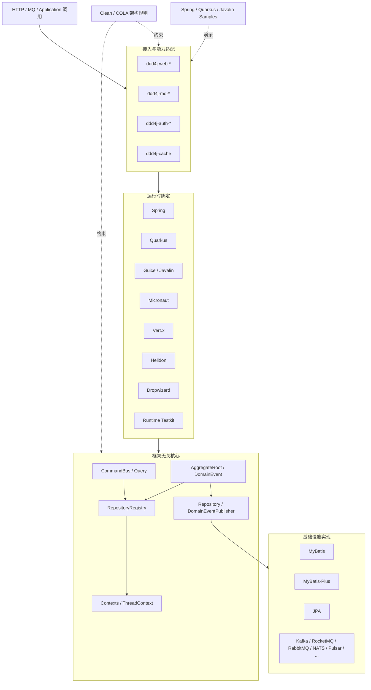
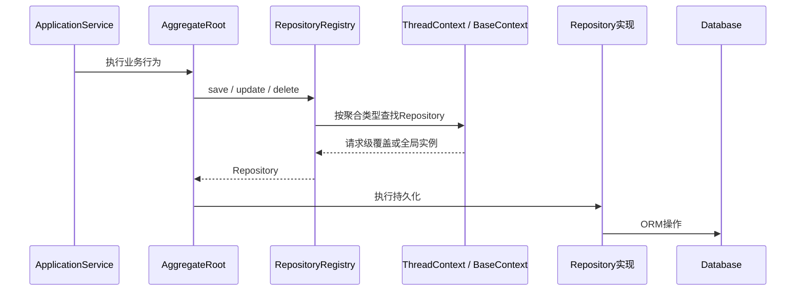
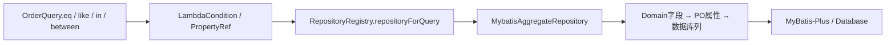
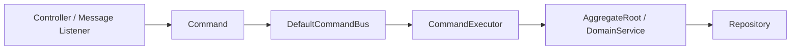
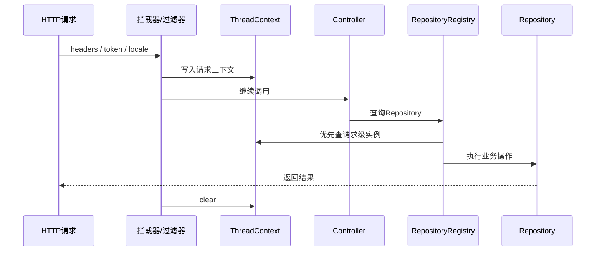
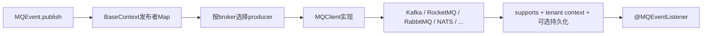

# ddd4j 当前源码架构导览

> 本文从当前源码、Maven 模块和 CodeGraph 符号调用关系出发，说明 ddd4j 的实际运行结构。
> 它描述的是当前可见实现，不替代各版本迁移指南和历史架构评审。

## 1. 一句话定位

ddd4j 是一套面向 Java 17 的框架无关 DDD/CQRS 基础框架：

- `ddd4j-core` 定义聚合根、查询、命令、仓储、领域事件和上下文 SPI；
- `ddd4j-data`、`ddd4j-mq`、`ddd4j-web`、`ddd4j-auth`、`ddd4j-cache` 提供能力适配；
- `ddd4j-runtime-*` 将核心 SPI 绑定到不同 DI 容器和事件总线；
- `ddd4j-ddd-rules` 通过 ArchUnit 将分层约束变成可执行规则；
- 自动装配、starter 和业务应用仍应位于具体框架脚手架或业务工程中。

## 2. 源码快照

本文最近一次通过 CodeGraph 校准时的源码状态：

| 项目 | 值 |
| --- | --- |
| 分支 | `feature/2.0.x` |
| 提交 | `7ed81da6`（2026-07-15） |
| Maven 版本 | `2.0.x.20260630-SNAPSHOT` |
| Java 基线 | 17 |
| CodeGraph | 1,414 文件 / 24,925 节点 / 50,755 条关系 |

这些计数只用于说明分析覆盖范围。架构判断应始终以当前源码和 `pom.xml` 为准。

## 3. 总体架构



## 4. 模块职责

| 层次 | 模块 | 职责 |
| --- | --- | --- |
| 版本与发布 | `ddd4j-bom`、`ddd4j-dependencies`、`ddd4j-parent` | BOM、第三方依赖版本、构建与发布规则 |
| 契约 | `ddd4j-annotation`、`ddd4j-core`、`ddd4j-kit` | DDD 注解、核心模型与 SPI、通用工具 |
| 架构守护 | `ddd4j-ddd-rules` | Clean/COLA 包结构与依赖方向检查 |
| 数据 | `ddd4j-data` | MyBatis、MyBatis-Plus、JPA、加密、数据权限、外部服务和日志 |
| 消息 | `ddd4j-mq` | MQ 事件模型、客户端 SPI、Spring 桥接和多 Broker 实现 |
| Web | `ddd4j-web` | WebMVC、WebFlux、Javalin、Quarkus、Vert.x、Micronaut、Helidon、Dropwizard 适配 |
| 鉴权与缓存 | `ddd4j-auth`、`ddd4j-cache` | Sa-Token、Spring Security、Shiro 和多种缓存实现 |
| 运行时 | `ddd4j-runtime` | Spring、Quarkus、Guice、Micronaut、Vert.x、Helidon、Dropwizard 容器绑定 |
| 扩展 | `ddd4j-extensions` | Excel、License、Monitor、QLExpress、二维码等横向扩展 |
| 示例 | `ddd4j-samples` | 普通 DDD、CQRS 和鉴权组合的可运行示例 |

## 5. 聚合根与仓储链路

[`AggregateRoot`](../../ddd4j-core/src/main/java/io/ddd4j/core/ddd/model/AggregateRoot.java) 提供充血持久化、充血查询和领域事件缓冲能力。领域模型不直接依赖 ORM，而是通过 [`RepositoryRegistry`](../../ddd4j-core/src/main/java/io/ddd4j/core/ddd/repository/RepositoryRegistry.java) 查找 [`Repository`](../../ddd4j-core/src/main/java/io/ddd4j/core/ddd/repository/Repository.java) 实例。



仓储查找优先级是：

1. `ThreadContext` 中的请求级或租户级覆盖；
2. `BaseContext` 中的 JVM 全局实例；
3. `RepositoryRegistry` 的兼容静态映射。

## 6. Query DSL 与数据适配

[`Query`](../../ddd4j-core/src/main/java/io/ddd4j/core/cqrs/query/Query.java) 同时是 ORM 无关查询 AST 和充血查询入口。它支持 Lambda 条件、排序、分页、选择列、分组以及租户控制。



[`MybatisAggregateRepository`](../../ddd4j-data/ddd4j-data-mybatisplus/src/main/java/io/ddd4j/data/mybatis/repository/MybatisAggregateRepository.java) 在初始化时完成：

- Aggregate、PO、Query 泛型解析；
- Domain 与 PO、Query、模型名称之间的映射；
- Repository 注册；
- Domain 属性到数据库列的翻译；
- MyBatis-Plus TableInfo、租户、逻辑删除和自动填充能力接入。

## 7. CommandBus

`DefaultCommandBus` 持有一组 `CommandExecutor`，根据 executor 支持的命令类型完成路由和执行。业务命令只表达意图，执行逻辑进入 ApplicationService/CommandExecutor，领域规则继续留在聚合根和领域服务中。



## 8. Web 请求与上下文

各 Web 适配器负责协议差异，核心上下文语义保持一致。以 WebMVC 的 [`ContextWebInterceptor`](../../ddd4j-web/ddd4j-web-webmvc/src/main/java/io/ddd4j/web/webmvc/interceptor/ContextWebInterceptor.java) 为例，请求开始时写入租户、会话、用户、Token 和 Locale，请求结束后清理线程上下文。



动态 [`AggregateController`](../../ddd4j-web/ddd4j-web-webmvc/src/main/java/io/ddd4j/web/webmvc/api/AggregateController.java) 通过模型名称、`MappingKit` 和 `RepositoryRegistry` 提供通用 CRUD。它适合管理端或平台型接口；具有明确业务语义的写操作仍应使用 Command/ApplicationService。

## 9. 领域事件与 MQ 事件

当前源码存在两条事件轨道：

| 类型 | 用途 | 发布方式 |
| --- | --- | --- |
| `DomainEvent` | 进程内领域通知，同时携带事件溯源元数据 | `DomainEventPublisher`，由运行时适配到容器事件总线 |
| `MQEvent` | 跨进程 Broker 消息 | `MQClient` 注册的 Broker Producer |

领域事件运行时适配包括 Spring ApplicationEventPublisher、Quarkus/Helidon CDI Event、Guava EventBus、Micronaut EventPublisher、Vert.x EventBus 和 Dropwizard 显式 Listener。

当前需要特别注意：`AggregateRoot` 已能 `registerEvent()`、`pullDomainEvents()`，但 CodeGraph 没有发现生产代码中的“Repository 提交成功 → 拉取事件 → 自动发布”完整调用链。事务提交后的可靠领域事件派发仍需由应用服务显式处理，或在后续补充统一的 Unit of Work/Outbox 集成。

MQ 链路如下：



## 10. 架构守护

`ddd4j-ddd-rules` 将 DDD 约束落实为 ArchUnit 规则，主要检查：

- DomainEntity、DomainService 必须位于领域层；
- ApplicationService、CommandExecutor、QueryService 必须位于应用层；
- DomainRepository 实现必须位于基础设施层；
- 领域层不得依赖 Controller、Adapter、Infrastructure、Spring 或 MyBatis；
- Clean/COLA 的目录结构和依赖方向必须闭合。

这部分不是说明性约定，而应作为业务工程 CI 中的架构测试执行。

## 11. 当前设计边界

1. 根版本仍是 `2.0.x`，部分核心 API 标注 `@since 4.0.0`，表明下一代 API 正在当前分支逐步形成，发布前需要统一版本语义。
2. `RepositoryRegistry` 同时维护 Context 注入和兼容静态 Map；测试隔离、多 ClassLoader 和资源清理需要重点验证。
3. 动态 AggregateController 依赖字符串模型名、反射和全局映射，不应替代业务语义明确的 Command API。
4. 领域事件缓冲与发布 SPI 已存在，但事务提交后的自动发布闭环尚不完整。
5. MQ 抽象应保持单一类型体系；若将事件 SPI 下沉到 core，必须先明确它与 `io.ddd4j.mq.event.MQEvent` 的继承或适配关系，避免形成不兼容的重复模型。

## 12. 推荐阅读路线

1. 根 [`pom.xml`](../../pom.xml)：确认模块边界和版本基线；
2. [`AggregateRoot`](../../ddd4j-core/src/main/java/io/ddd4j/core/ddd/model/AggregateRoot.java)：理解充血模型；
3. [`Query`](../../ddd4j-core/src/main/java/io/ddd4j/core/cqrs/query/Query.java)：理解查询 AST 和充血执行；
4. [`RepositoryRegistry`](../../ddd4j-core/src/main/java/io/ddd4j/core/ddd/repository/RepositoryRegistry.java)：理解运行时解耦；
5. [`MybatisAggregateRepository`](../../ddd4j-data/ddd4j-data-mybatisplus/src/main/java/io/ddd4j/data/mybatis/repository/MybatisAggregateRepository.java)：理解领域模型到数据库的映射；
6. [`DomainEvent`](../../ddd4j-core/src/main/java/io/ddd4j/core/ddd/event/DomainEvent.java)：理解进程内事件；
7. [`MQClient`](../../ddd4j-mq/ddd4j-mq-core/src/main/java/io/ddd4j/mq/MQClient.java)：理解多 Broker 路由；
8. `ddd4j-sample-javalin-cqrs`：观察框架无关运行方式；
9. `ddd4j-sample-quarkus-cqrs`：观察 CDI/JPA 适配；
10. 外部 `ddd4j-boot-samples/ddd4j-boot-sample-order`：观察 Spring Boot 完整集成。

## 13. CodeGraph 维护命令

架构调整后可使用以下命令重新校准本文：

```bash
codegraph sync
codegraph status
codegraph explore "AggregateRoot Query RepositoryRegistry MybatisAggregateRepository"
codegraph explore "DomainEvent DomainEventPublisher MQEvent MQClient"
codegraph callers pullDomainEvents
codegraph callers RepositoryRegistry
```
