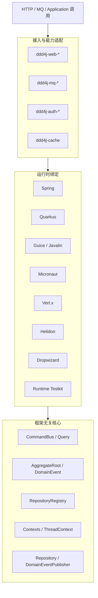

# ddd4j 当前源码架构导览设计

- **日期**：2026-07-15
- **作者**：ddd4j 架构团队
- **状态**：已实施
- **源码快照**：feature/2.0.x 分支，提交 `7ed81da6`（2026-07-15），Maven 版本 `2.0.x.20260630-SNAPSHOT`，Java 基线 17
- **CodeGraph**：1,414 文件 / 24,925 节点 / 50,755 条关系

## 1. 目标与范围

从当前源码、Maven 模块和 CodeGraph 符号调用关系出发，说明 ddd4j 的实际运行结构。描述的是当前可见实现，不替代各版本迁移指南和历史架构评审。

## 2. 一句话定位

ddd4j 是一套面向 Java 17 的框架无关 DDD/CQRS 基础框架：

- `ddd4j-core` 定义聚合根、查询、命令、仓储、领域事件和上下文 SPI
- `ddd4j-data`、`ddd4j-mq`、`ddd4j-web`、`ddd4j-auth`、`ddd4j-cache` 提供能力适配
- `ddd4j-runtime-*` 将核心 SPI 绑定到不同 DI 容器和事件总线
- `ddd4j-ddd-rules` 通过 ArchUnit 将分层约束变成可执行规则

## 3. 总体架构

## 4. 核心契约层

`ddd4j-core` 是当前主线的中心：

- `io.ddd4j.core.ddd.event.DomainEvent`：领域事件基类
- `io.ddd4j.core.ddd.event.DomainEventPublisher`：领域事件发布 SPI
- `io.ddd4j.core.ddd.repository.Repository`：聚合仓储 SPI
- `io.ddd4j.core.cqrs.command.Command`：CQRS 命令标记接口
- `io.ddd4j.core.cqrs.readmodel.TypedEventHandler`：读模型事件处理器

## 5. DDD 架构规则

- `ddd4j-ddd-rules-clean`：Clean Architecture 分层纪律规则
- `ddd4j-ddd-rules-cola`：COLA 菱形架构分层纪律规则

`CleanDDDLayerRules` 检查：
- `@DomainEntity`、`@DomainService` 必须在 `domain` 包
- `@ApplicationService`、`@CommandExecutor`、`@QueryService` 必须在 `app` 或 `application` 包
- `@DomainRepository` 必须在 `infrastructure` 或 `infras` 包
- `domain` 包不得依赖 `web/controller/adapter`、`infrastructure/infras`、Spring/MyBatis 等框架

## 6. 运行时绑定

事件发布的绑定关系：

- **Spring**：`SpringDomainEventPublisher` 通过 `ApplicationEventPublisher.publishEvent` 发布领域事件
- **Quarkus**：`CdiDomainEventPublisher` 通过 CDI `Event<Object>.fire` 发布
- **Guice/Javalin**：`GuiceDomainEventPublisher` 通过 Guava `EventBus.post` 发布

## 7. MQ 核心关系

- `MQClient` 是 broker 实现的统一 SPI
- 生产者通过 `BaseContext` 注册到 `MQEvent.MQ_EVENT_PUBLISHER`
- 消费时 `MQClient.consume` 按 `event.supports(listener.supports())` 过滤
