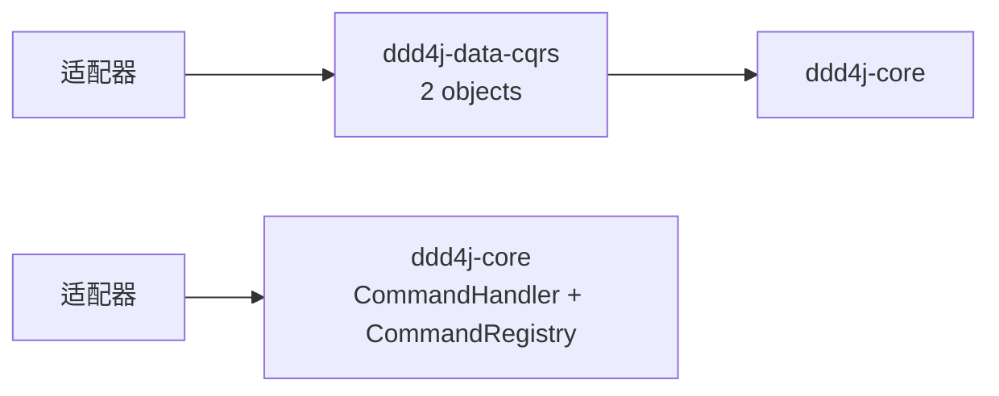
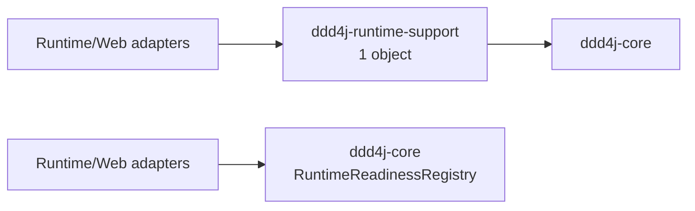

# 三线模块粒度收敛规格

## 目标

消除仅承担同一核心能力内部实现、没有独立依赖隔离或生命周期价值的 Maven 模块，同时保持
1.0.x、2.0.x、3.0.x 的目录拓扑、对象、方法和参数一致。

## 判定规则

模块不能只凭对象数量保留或删除。至少按以下维度判定：

1. 是否隔离独立第三方依赖或框架版本。
2. 是否具有独立运行时、配置、部署或发布生命周期。
3. 是否是稳定的外部复用/API 边界。
4. 代码是否与上游模块高内聚，且消费者已经必然依赖该上游模块。
5. 独立 POM、BOM、CI、版本治理成本是否大于边界收益。

## 第一批决策

### 合并 `ddd4j-data-cqrs` 到 `ddd4j-core`

- 仅包含 `CommandHandler`、`CommandRegistry` 两个对象。
- 除 `ddd4j-core`、`ddd4j-annotation` 外无独立依赖；core 已依赖 annotation。
- 无独立运行时、配置、部署或发布生命周期。
- 三条线各自的所有框架适配器本就使用 core 命令契约；合并后改为直接依赖 core，
  额外模块边只会增加构建和版本治理成本。
- 迁入 core 后统一改为 `io.ddd4j.core.cqrs.command`，目录与 Java package 对齐；
  三条线的类名、方法和参数保持一致。
- 原模块中的注解、注册表与架构测试一并迁入 core，禁止遗留孤儿测试目录。

### 合并 `ddd4j-runtime-support` 到 `ddd4j-core`

- 仅包含 `RuntimeReadinessRegistry` 一个生产对象，且只依赖 `ddd4j-core`。
- CodeGraph 识别到 20 个 runtime/web/test 调用点，但消费者数量不是独立制品边界；这些消费者本就依赖 core 能力。
- 无独立第三方依赖、配置、部署或发布生命周期，不进入对外 BOM。
- 迁入 core 后统一改为 `io.ddd4j.core.health`，目录与 Java package 对齐；
  三条线的构造器、方法、参数和返回值保持一致。
- 原契约测试同步迁入 core；消费者删除中转依赖，原本没有直接依赖 core 的模块改为直接依赖 core。

## 小模块审计结论

对象数量只是筛选条件，不是删除条件。对 1.0.x 全部 0–3 个生产对象模块逐个检查后，分类如下：

| 类型 | 代表模块 | 决策 | 依据 |
|---|---|---|---|
| 框架/厂商适配器 | `ddd4j-data-cqrs-*`、`ddd4j-data-projection-*`、`ddd4j-auth-shiro`、`ddd4j-mq-*` | 保留 | 隔离第三方依赖、框架版本和可选能力；对象少但边界真实 |
| 持久化适配器 | `ddd4j-data-event-store-*`、`ddd4j-data-projection-jdbi/jpa/r2dbc` | 保留 | 隔离数据库驱动、ORM/响应式栈和事务语义 |
| 可复用测试边界 | `ddd4j-sample-order-testkit` | 保留 | 发布可复用契约测试，不属于生产 core |
| 框架无关 CQRS 注册能力 | `ddd4j-data-cqrs` | 合并到 core | 无独立依赖、生命周期或发布价值，且仅两个对象 |
| 框架无关 runtime readiness | `ddd4j-runtime-support` | 合并到 core | 无外部依赖或独立生命周期，20 个调用点均可直接复用 core |
| 响应式投影核心 | `ddd4j-data-projection` | 保留 | 独立隔离 Reactor API；合并到 core 会反向污染 core |
| 日志切面 | `ddd4j-data-logs` | 保留 | 隔离 AspectJ、Servlet/Web 等横切依赖 |
| 数据权限契约 | `ddd4j-data-datascope` | 保留 | 隔离 Bean Validation API，并被 MyBatis 插件等数据层消费者复用 |
| 指标适配 | `ddd4j-metrics` | 保留 | `OpenTelemetryProjectionMetrics` 是 OTel 厂商适配器，隔离可选 OTel API |

## 版本边界

- 1.0.x 使用 JDK8；`Helidon 3.2.18` 不支持 JDK8，因此不通过降级 Helidon 2.x
  维持另一套实现线，runtime、web、data adapter 与两个 sample 的 Helidon 模块均完整删除。
- 2.0.x、3.0.x 的 Helidon 模块不受本项版本差异处理影响。

## 验收标准

1. 三条线均不存在 `ddd4j-data/ddd4j-data-cqrs` Maven 模块。
2. 两个对象在三条线的 `ddd4j-core/src/main/java/io/ddd4j/core/data/cqrs` 中存在，
   FQCN 分别为 `io.ddd4j.core.cqrs.command.CommandHandler` 和 `io.ddd4j.core.cqrs.command.CommandRegistry`。
3. 所有 CQRS 框架适配器不再声明 `ddd4j-data-cqrs` 依赖。
4. 三条线均不存在 `ddd4j-runtime/ddd4j-runtime-support` Maven 模块。
5. `RuntimeReadinessRegistry` 在三条线的
   `ddd4j-core/src/main/java/io/ddd4j/core/runtime/health` 中存在，FQCN 为
   `io.ddd4j.core.health.RuntimeReadinessRegistry`。
6. runtime/web/testkit 消费者不再声明 `ddd4j-runtime-support` 依赖。
7. 三条线的目标 CQRS/readiness/core 测试通过。
8. 三条线目录结构保持一致；只允许已有 JDK、Maven、Jackson 与 sample/Quarkus 差异。

## 当前验证状态

- 1.0.x：迁入 core 的 CQRS/readiness 契约与架构测试 17 项通过；受影响 runtime/web
  生产依赖链 28/28 reactor 项编译成功；samples reactor 16/16 成功，385 项测试、
  0 失败、0 错误、0 跳过，并真实启动 PostgreSQL、Redis 与 Kafka Testcontainers。
- 2.0.x：迁入 core 的 CQRS/readiness 契约与架构测试 17 项通过；受影响依赖链
  31/31 reactor 项编译成功。
- 3.0.x：使用项目 Maven Wrapper（Maven 4.0.0-rc-6）与 JDK21 执行受影响范围，
  120/120 reactor 项成功；迁入 core 的 CQRS/readiness 契约与架构测试 17 项通过。
- 三版本 `javap -public` 输出一致：三个迁入对象使用统一的新 FQCN，构造器、方法、泛型、
  参数与返回值均无差异。
