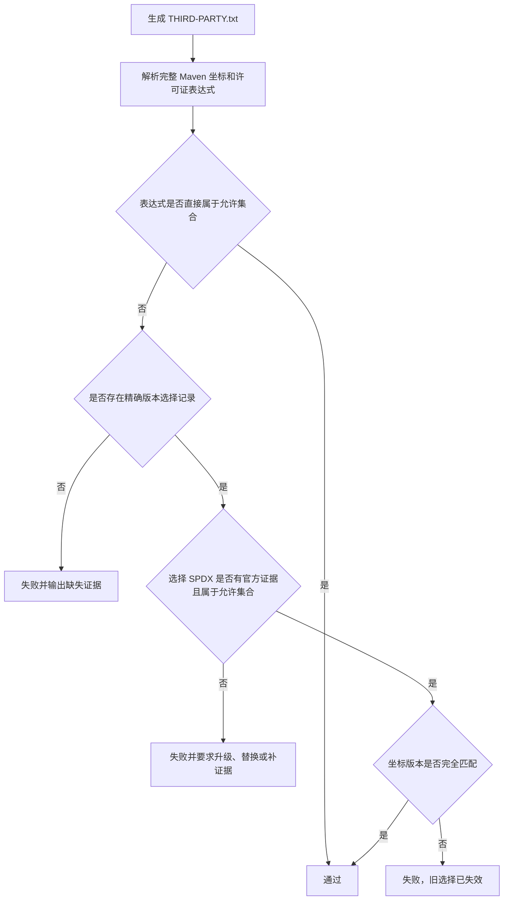

# ddd4j 许可证门禁强化设计

## 1. 状态与范围

- 状态：待评审
- 适用分支：`feature/1.0.x`、`feature/2.0.x`、`feature/3.0.x`
- 本阶段目标：修复 1.0.x、3.0.x 许可证 CI 红灯，同时保持 2.0.x 已通过状态。
- 非目标：本设计不修改 MQ、Readiness、认证、EventStore、Outbox、覆盖率、CVE 或发布版本类型。
- 合规说明：自动门禁提供工程证据和策略执行，不替代组织法律审查。

## 2. 已确认原则

1. 许可证判定必须精确到 Maven `groupId:artifactId:version`。
2. 双许可证或多许可证必须明确选择其中一个兼容分支，禁止仅因表达式包含未知许可证而整体拒绝。
3. 允许在具有官方证据时选择 `CDDL-1.1`。
4. 自动允许的宽松许可证集合为：
   - `Apache-2.0`
   - `MIT`
   - `BSD-2-Clause`
   - `BSD-3-Clause`
   - `ISC`
   - `MulanPSL-2.0`
   - `UPL-1.0`、`W3C`、`Bouncy-Castle`、`CC0-1.0`、`MIT-0` 和 Public Domain
5. `EPL-1.0/2.0`、`MPL-1.1/2.0`、`CDDL-1.0/1.1` 作为未修改的独立第三方 JAR 有条件允许；不得复制、修改、fork 或静态合并其覆盖源码，发布时保留许可证、NOTICE、版权和上游源码地址。
6. `GPL-2.0-with-classpath-exception` 只能作为官方声明表达式的一部分记录；多许可证默认优先选择同一坐标提供的 Apache、EPL、MPL 或 CDDL 分支。
7. GPL、AGPL、LGPL、SSPL、BUSL、Commons Clause、Non-Commercial、Commercial-only、WTFPL 和 Unknown 默认禁止。
8. 没有兼容分支、官方证据不足或许可证真实不兼容的依赖必须升级、替换或移除，不得白名单放行。

## 3. 证据模型

`config/license-selections.tsv` 调整为以下字段：

| 字段 | 含义 |
|---|---|
| `coordinate` | 完整 `groupId:artifactId:version` |
| `declared_expression` | 报告或官方 POM 声明的许可证表达式 |
| `selected_spdx` | 本项目明确选择的兼容 SPDX 标识 |
| `evidence_url` | 官方 POM、官方 LICENSE 或官方源码仓库固定版本链接 |
| `evidence_type` | `POM`、`LICENSE` 或 `UPSTREAM_SOURCE` |
| `justification` | 为什么该选择满足项目策略 |

证据必须满足：

- URL 指向上游官方域名或官方源码仓库。
- GitHub 证据优先使用固定 tag/commit，不使用会漂移的默认分支页面。
- 版本变化后，旧坐标记录不能匹配新版本。
- `selected_spdx` 必须出现在 `declared_expression` 或官方证据中。
- 字段不能为空，不接受 `unknown`、`n/a`、`TODO` 等占位内容。

## 4. 判定流程

## 5. 三线策略

### 5.1 1.0.x / JDK 8

- 核实 JSQLParser 4.9、Javax Activation/JAXB/EL/Jersey、JNA、JCIP 等失败坐标。
- 对官方声明的双许可证选择 Apache、EPL 或已批准的 CDDL 分支。
- JDK 8 兼容性决定无法升级时，许可证证据仍必须精确到当前版本。
- 无兼容许可证的依赖必须替换，不以 JDK 8 兼容为豁免理由。

### 5.2 2.0.x / JDK 17

- 保持当前许可证门禁通过。
- 同步校验器结构和 TSV schema。
- 不复制 1.0.x/3.0.x 中不存在于本分支的坐标选择。

### 5.3 3.0.x / JDK 21

- 核实 `net.java.dev.jna:jna:5.18.1` 官方双许可证声明。
- 明确选择兼容许可证分支并记录固定版本证据。
- 保持 Maven 4 模型门禁和许可证门禁相互独立。

## 6. 校验器行为

`scripts/verify-license-policy.sh` 应拆出可单元测试的解析与判定实现，保留 shell 入口供 CI 调用。

必须拒绝：

- 缺少完整版本的坐标。
- 宽泛到 groupId、artifactId 或正则的选择。
- 选择的 SPDX 不属于允许集合。
- 证据 URL 为空或不是上游官方来源。
- 版本升级后继续复用旧记录。
- 报告不存在、为空或解析失败。
- 选择文件存在未被报告使用的陈旧条目。
- 新增未知许可证或未审核的多许可证表达式。

必须接受：

- 单一允许许可证。
- 官方声明的多许可证中明确选择一个允许分支。
- 未修改独立 JAR 形式的 EPL、MPL 和 CDDL 依赖，并生成分发义务记录。
- `MulanPSL-2.0` 等已批准宽松许可证。

## 7. 测试策略

1. 单元测试覆盖：
   - 单许可证通过。
   - 双许可证选择通过。
   - CDDL-1.1 选择通过。
   - 缺版本、证据缺失、证据域错误、选择不在声明中、陈旧条目均失败。
2. 分支本地门禁：
   - 生成真实 `THIRD-PARTY.txt`。
   - 执行许可证策略验证。
   - 执行完整 Reactor `clean verify`。
3. CI 门禁：
   - `SBOM and license reports` 必须成功。
   - 上传 THIRD-PARTY、选择记录摘要和失败坐标报告。
4. 三线一致性：
   - 校验器对象、方法、参数和脚本入口一致。
   - 仅坐标版本和实际选择记录允许不同。

## 8. 验收标准

- 1.0.x、2.0.x、3.0.x 真实许可证报告均通过策略校验。
- 1.0.x、3.0.x GitHub Actions 许可证 job 由红转绿。
- 每个例外都有完整版本、SPDX选择、固定官方证据和理由。
- 不存在 group/artifact级宽泛白名单。
- 不存在通过忽略脚本错误、跳过 job 或允许任意 unknown 实现的假绿。
- 三线完整 Reactor测试仍通过。
- 未满足以上全部条件前，不进入 MQ启动与生命周期阶段。
