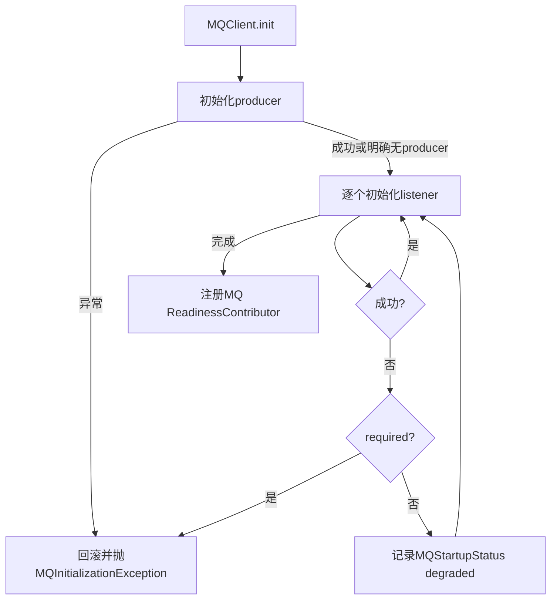

# ddd4j MQ 启动与生命周期设计

## 1. 状态与范围

- 状态：待评审
- 适用分支：`feature/1.0.x`、`feature/2.0.x`、`feature/3.0.x`
- 目标：消除MQ消费者初始化失败后应用以“零消费者”继续运行的fail-open风险，并统一所有MQ客户端资源关闭行为。
- 非目标：本阶段不实现持久化Outbox、不修改消息重试状态机、不处理全局空Readiness集合、不修改EventStore位置分配。

## 2. 兼容性原则

1. 保留 `MQClient.init(...)`、`initProducer(...)`、`initConsumer(...)`、`start()` 和 `close()` 的现有公开签名。
2. `MQEventListener`仅增加 `boolean required() default true`，已有监听器默认成为必选消费者。
3. `MQListener`增加对应 `required` 属性，同时显式保留当前七参数公开构造器并新增八参数构造器，避免Lombok重新生成构造器导致二进制破坏。
4. 1.0.x使用Java 8兼容实现；2.0.x使用Java 17；3.0.x使用Java 21，但不因语法升级改变生命周期语义。
5. 关闭操作必须幂等；调用两次或在部分初始化后调用不得抛出“已关闭”类异常。

## 3. 启动模型

### 3.1 必选消费者

当 `MQListener.required == true` 时：

- `initConsumer`返回 `false` 视为初始化失败。
- `initConsumer`抛出异常视为初始化失败。
- `MQClient.init`立即停止后续监听器初始化。
- 回滚本次初始化过程中创建的生产者和消费者资源。
- 删除本次注册到 `BaseContext` publisher map中的对应publisher。
- 抛出 `MQInitializationException`，包含broker、topic、group、listener方法和原始原因。
- Spring桥接层必须继续向容器传播异常，使ApplicationContext启动失败。

### 3.2 可选消费者

当 `MQListener.required == false` 时：

- 初始化失败不终止进程启动。
- 失败必须写入 `MQStartupStatus`，禁止仅记录日志。
- MQ readiness返回不可用，并包含broker、topic、group和安全错误摘要。
- 其他监听器继续初始化。
- 当前版本不做后台自动重试；配置修复后通过应用重启重新初始化。

### 3.3 生产者

- MQ启用且broker匹配时，生产者初始化异常始终属于必选启动失败。
- `initProducer`返回null表示该适配器明确不提供发布能力，不视为异常。
- publisher只有在生产者初始化成功后才进入 `BaseContext`。
- 后续必选消费者失败时必须撤销该publisher并关闭生产者资源。

## 4. 状态与异常对象

### 4.1 `MQInitializationException`

- 包：`io.ddd4j.mq.lifecycle`
- 继承：`IllegalStateException`
- 字段：`broker`、`topic`、`group`、`listenerMethod`
- 保留原始cause，不把账号、密码、完整payload写入消息。

### 4.2 `MQListenerInitializationFailure`

- 包：`io.ddd4j.mq.lifecycle`
- 不可变值对象。
- 字段：`broker`、`topic`、`group`、`listenerMethod`、`required`、`reason`。
- `reason`只保留异常类型和安全摘要。

### 4.3 `MQStartupStatus`

- 包：`io.ddd4j.mq.lifecycle`
- 线程安全维护初始化状态和不可变失败快照。
- 状态：`NEW`、`STARTING`、`READY`、`DEGRADED`、`FAILED`、`STOPPED`。
- `READY`要求所有声明的监听器成功。
- 可选监听器失败为 `DEGRADED`；必选失败为 `FAILED`。
- 关闭完成后为 `STOPPED`。

### 4.4 `MQReadinessContributor`

- 包：`io.ddd4j.mq.lifecycle`
- 实现 `io.ddd4j.core.health.ReadinessContributor`。
- `READY`返回available；`NEW/STARTING/DEGRADED/FAILED/STOPPED`均返回unavailable。
- 本对象只反映MQ状态；全局空Contributor语义留到阶段3统一处理。

## 5. 资源生命周期

新增 `MQClientLifecycle`：

- 包：`io.ddd4j.mq.lifecycle`
- 使用线程安全LIFO关闭栈。
- `register(String name, Runnable closeAction)`登记资源关闭动作。
- `checkpoint()`记录本次初始化前位置。
- `rollback(checkpoint)`只关闭本次初始化新建资源。
- `close()`逆序关闭全部资源。
- `AtomicBoolean`保证全量关闭只执行一次。
- 单个close action失败时继续关闭其他资源，最后抛出一个聚合异常并将其余异常加入suppressed。
- 不登记密码、消息正文和连接字符串。

`MQClient`增加有默认实现的 `lifecycle()` 和 `startupStatus()`访问器，保证第三方自定义实现保持二进制兼容；ddd4j内置适配器覆盖它们并返回实例级对象。默认实现不持有全局静态状态，避免classloader和client泄漏。

各适配器必须登记实际持有资源：

| 适配器 | 必须关闭的资源 |
|---|---|
| Kafka | consumers、producer flush/close、消费线程池 |
| RabbitMQ | consumer channels、线程本地producer channels、connection（仅自行创建时） |
| MQTT | subscriptions、client disconnect/close、executor |
| Mica MQTT | client、subscriptions、executor |
| NATS | JetStream subscriptions/dispatchers、connection drain/close |
| RocketMQ | consumers shutdown、producer shutdown |
| ActiveMQ | consumers、sessions、connections |
| Pulsar | consumers、producer、client |
| Redis Stream | polling tasks、executor、operations/client（仅拥有时） |
| SQS | polling tasks、executor、async client |
| ONS/TDMQ | consumers、producer/client |
| Disruptor | disruptor shutdown/halt |

所有权规则：构造器注入的外部共享资源默认不由客户端关闭；适配器自行创建的资源必须关闭。构造器或工厂必须显式记录ownership，禁止猜测。

## 6. Spring生命周期

`MQListenerRegistrar`：

- 根上下文只初始化一次。
- 不再catch后仅log；必选失败包装为Spring `ApplicationContextException`继续抛出。
- 实现 `DisposableBean`，按MQClient注册逆序调用 `close()`。
- 关闭所有客户端后再清理publisher注册。
- 多次ContextRefreshedEvent和多次destroy均保持幂等。
- 可选失败时容器可以启动，但自动注册的 `MQReadinessContributor`返回不可用。

## 7. 错误与观测

- 启动日志必须包含broker、成功监听器数、失败监听器数和最终状态。
- 必选失败记录一次ERROR并抛出，不在多层重复打印完整堆栈。
- 可选失败记录WARN并进入结构化状态。
- close失败记录资源名，不记录认证信息。
- `MQStartupStatus`提供只读快照供Spring、Quarkus、Micronaut、Helidon、Javalin、Vert.x和Dropwizard运行时映射。

## 8. 测试策略

### 8.1 核心契约

- producer失败不会留下publisher。
- 必选listener返回false或抛异常时init失败。
- 可选listener失败时继续初始化后续listener并进入DEGRADED。
- 部分初始化失败只回滚本次资源。
- `close()`调用两次，底层资源只关闭一次。
- 一个资源关闭失败不阻止其余资源关闭，异常被聚合。

### 8.2 Spring契约

- 必选失败导致Context启动失败。
- 可选失败时Context启动成功但readiness不可用。
- 父子上下文不重复初始化。
- Context关闭时客户端逆序关闭且只关闭一次。

### 8.3 适配器契约

- 每个MQ实现至少包含资源创建、初始化失败回滚、正常关闭、重复关闭四类测试。
- 对支持flush/drain的broker验证调用顺序。
- Testcontainers验证真实broker连接在Context关闭后释放。

## 9. 验收标准

- 三线对象名、FQCN、公开方法和参数一致。
- 必选消费者初始化失败时应用启动失败。
- 可选消费者失败时应用可启动但MQ readiness不可用。
- 所有MQ客户端关闭幂等且无已知连接、线程、consumer泄漏。
- 三线MQ核心与适配器契约测试全部通过。
- 三线完整Reactor和samples测试通过。
- GitHub Actions全部通过。
- 未达到以上条件前不进入阶段3 Readiness与认证治理。
